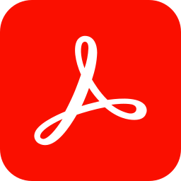
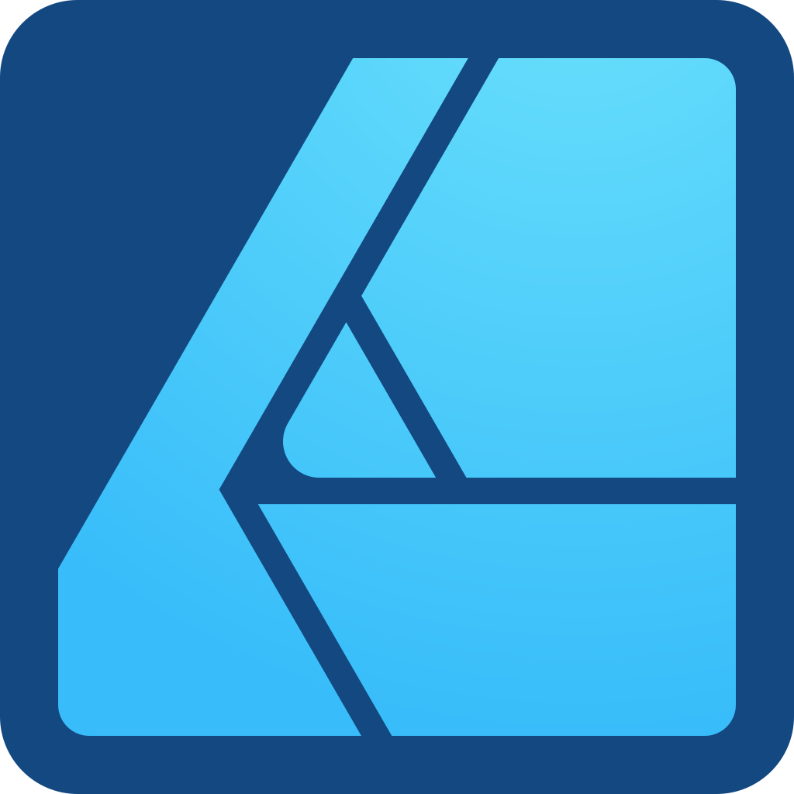
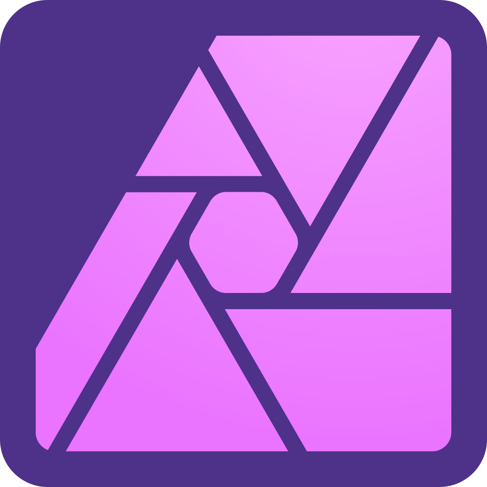
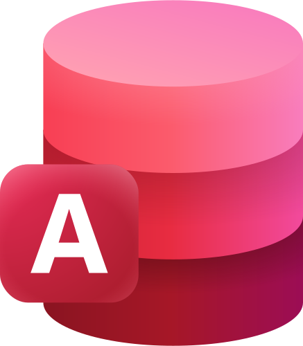
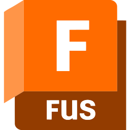
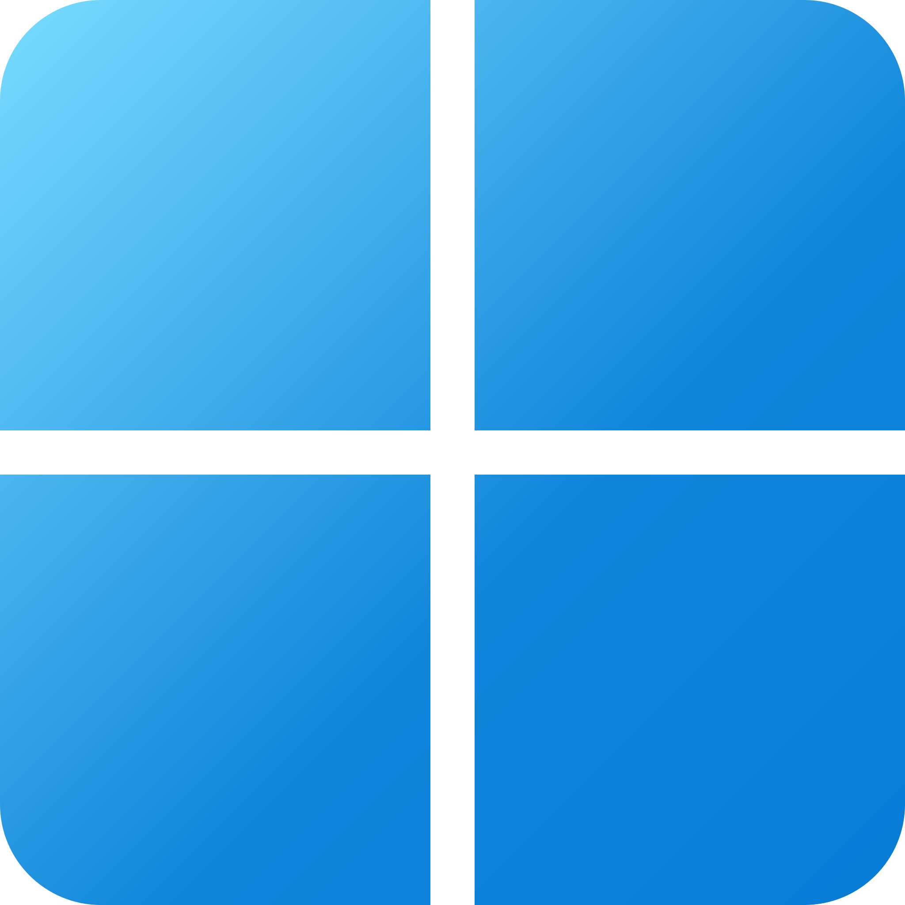

<p align="center"></p>
<p align="center"></p>
<hr>

Run Windows applications (including [Microsoft 365](https://www.microsoft365.com/) and [Adobe Creative Cloud](https://www.adobe.com/creativecloud.html)) on GNU/Linux with `KDE Plasma`, `GNOME` or `XFCE` and on **macOS**, integrated seamlessly as if they were native to the OS.

<p align="center"></p>

## Underlying Mechanism
WinApps works by:
1. Running Windows in a `Docker`, `Podman` or `libvirt` virtual machine (or connecting to any Windows machine with RDP enabled).
2. Querying Windows for all installed applications.
3. Creating shortcuts to selected Windows applications on the host OS.
4. Using [`FreeRDP`](https://www.freerdp.com/) (Linux) or Microsoft ["Windows App"](https://apps.apple.com/app/windows-app/id1295203466) (macOS) as a backend to seamlessly render Windows applications alongside native applications.

## Additional Features
- The GNU/Linux `/home` directory is accessible within Windows via the `\\tsclient\home` mount.
- Integration with `Nautilus`, allowing you to right-click files to open them with specific Windows applications based on the file MIME type.
- The [official taskbar widget](https://github.com/winapps-org/WinApps-Launcher) enables seamless administration of the Windows subsystem and offers an easy way to launch Windows applications.
- Microsoft Office links (e.g. ms-word://) from the host system are automatically opened in the Windows subsystem. (Note: You may need to use a [User Agent Switcher](https://github.com/ray-lothian/UserAgent-Switcher/) browser extension and set the User-Agent to Windows, as the Office webapps typically hide the "Open in Desktop App" option for Linux users.)

## Supported Applications
**WinApps supports <u>*ALL*</u> Windows applications.** Support does not, however, extend to kernel-level anti-cheat systems (e.g. Riot Vanguard).

Universal application support is achieved by:
1. Scanning Windows for any community tested applications (list below).
2. Scanning Windows for any other `.exe` files listed within the Windows Registry.

Community tested applications benefit from high-resolution icons and pre-populated MIME types. This enables file managers to determine which Windows applications should open files based on file extensions. Icons for other detected applications are pulled from `.exe` files.

Contributing to the list of supported applications is encouraged through submission of pull requests! Please help us grow the WinApps community.

*Please note that the provided list of community tested applications is community-driven. As such, some applications may not be tested and verified by the WinApps team.*

### Community Tested Applications
<table cellpadding="10" cellspacing="0" border="0">
    <tr>
        <!-- Adobe Acrobat Pro -->
        <td>
            
        </td>
        <td>
            <b>Adobe Acrobat Pro</b><br>
            (X)<br>
            <i><a href="https://commons.wikimedia.org/wiki/File:Adobe_Acrobat_DC_logo_2020.svg">Icon</a> in the Public Domain.</i>
        </td>
        <!-- Adobe After Effects -->
        <td>
            
        </td>
        <td>
            <b>Adobe After Effects</b><br>
            (CC)<br>
            <i><a href="https://commons.wikimedia.org/wiki/File:Adobe_After_Effects_CC_icon.svg">Icon</a> in the Public Domain.</i>
        </td>
    </tr>
    <tr>
        <!-- Adobe Audition -->
        <td>
            
        </td>
        <td>
            <b>Adobe Audition</b><br>
            (CC)<br>
            <i><a href="https://en.m.wikipedia.org/wiki/File:Adobe_Audition_CC_icon_%282020%29.svg">Icon</a> in the Public Domain.</i>
        </td>
        <!-- Adobe Bridge -->
        <td>
            
        </td>
        <td>
            <b>Adobe Bridge</b><br>
            (CS6, CC)<br>
            <i><a href="https://en.m.wikipedia.org/wiki/File:Adobe_Bridge_CC_icon.svg">Icon</a> in the Public Domain.</i>
        </td>
    </tr>
    <tr>
        <!-- Adobe Creative Cloud -->
        <td>
            
        </td>
        <td>
            <b>Adobe Creative Cloud</b><br>
            (CC)<br>
            <i><a href="https://iconduck.com/icons/240218/adobe-creative-cloud">Icon</a> under <a href="https://iconduck.com/licenses/mit">MIT license</a>.</i>
        </td>
        <!-- Adobe Illustrator -->
        <td>
            
        </td>
        <td>
            <b>Adobe Illustrator</b><br>
            (CC)<br>
            <i><a href="https://commons.wikimedia.org/wiki/File:Adobe_Illustrator_CC_icon.svg">Icon</a> in the Public Domain.</i>
        </td>
    </tr>
    <tr>
        <!-- Adobe InDesign -->
        <td>
            
        </td>
        <td>
            <b>Adobe InDesign</b><br>
            (CC)<br>
            <i><a href="https://commons.wikimedia.org/wiki/File:Adobe_InDesign_CC_icon.svg">Icon</a> in the Public Domain.</i>
        </td>
        <!-- Adobe Lightroom -->
        <td>
            
        </td>
        <td>
            <b>Adobe Lightroom</b><br>
            (CC)<br>
            <i><a href="https://commons.wikimedia.org/wiki/File:Adobe_Photoshop_Lightroom_CC_logo.svg">Icon</a> in the Public Domain.</i>
        </td>
    </tr>
    <tr>
        <!-- Adobe Photoshop -->
        <td>
            
        </td>
        <td>
            <b>Adobe Photoshop</b><br>
            (CS6, CC, 2022)<br>
            <i><a href="https://commons.wikimedia.org/wiki/File:Adobe_Photoshop_CC_icon.svg">Icon</a> in the Public Domain.</i>
        </td>
        <!-- Affinity Designer 2 -->
        <td>
            
        </td>
        <td>
            <b>Affinity Designer 2</b><br>
            <i><a href="https://commons.wikimedia.org/wiki/File:Affinity_Designer_V2_icon.svg">Icon</a> under CC-BY-SA 4.0 via Serif Ltd.</i>
        </td>
    </tr>
    <tr>
        <!-- Affinity Photo 2 -->
        <td>
            
        </td>
        <td>
            <b>Affinity Photo 2</b><br>
            <i><a href="https://commons.wikimedia.org/wiki/File:Affinity_Photo_V2_icon.svg">Icon</a> under CC-BY-SA 4.0 via Serif Ltd.</i>
        </td>
        <!-- Affinity Publisher 2 -->
        <td>
            
        </td>
        <td>
            <b>Affinity Publisher 2</b><br>
            <i><a href="https://commons.wikimedia.org/wiki/File:Affinity_Publisher_V2_icon.svg">Icon</a> under CC-BY-SA 4.0 via Serif Ltd.</i>
        </td>
        <tr>
        <!-- Affinity by Canva (v3)-->
        <td>
            
        </td>
            <td>
            <b>Affinity by Canva (v3)</b><br>
            <i><a href="https://commons.wikimedia.org/wiki/File:Affinity_(App)_Logo.svg">Icon</a> in the Public Domain.</i>
        </td>
        <!-- Command Prompt -->
        <td>
            
        </td>
        <td>
            <b>Command Prompt</b><br>
            (cmd.exe)<br>
            <i><a href="https://github.com/microsoft/terminal/blob/main/res/terminal/Terminal.svg">Icon</a> under <a href="https://github.com/microsoft/terminal/blob/main/LICENSE">MIT license</a>.</i>
        </td>
    </tr>
    <tr>
        <!-- File Explorer -->
        <td>
            
        </td>
        <td>
            <b>File Explorer</b><br>
            (Windows Explorer)<br>
            <i><a href="https://en.wikipedia.org/wiki/File:Microsoft_PowerToys-Logo_File_Explorer_Preview_02.svg">Icon</a> in the Public Domain.</i>
        </td>
        <!-- Internet Explorer -->
        <td>
            
        </td>
        <td>
            <b>Internet Explorer</b><br>
            (11)<br>
            <i><a href="https://commons.wikimedia.org/wiki/File:Internet_Explorer_10%2B11_logo.svg">Icon</a> in the Public Domain.</i>
        </td>
    </tr>
    <tr>
         <!-- Microsoft Access -->
        <td>
            
        </td>
        <td>
            <b>Microsoft Access</b><br>
            (2016, 2019, o365)<br>
            <i><a href="https://en.wikipedia.org/wiki/File:Microsoft_Office_Access_(2025-present).svg">Icon</a> in the Public Domain.</i>
        </td>
        <!-- Microsoft Excel -->
        <td>
            
        </td>
        <td>
            <b>Microsoft Excel</b><br>
            (2016, 2019, o365)<br>
            <i><a href="https://en.wikipedia.org/wiki/File:Microsoft_Office_Excel_(2025–present).svg">Icon</a> in the Public Domain.</i>
        </td>
    </tr>
    <tr>
        <!-- Microsoft Word -->
        <td>
            
        </td>
        <td>
            <b>Microsoft Word</b><br>
            (2016, 2019, o365)<br>
            <i><a href="https://en.wikipedia.org/wiki/File:Microsoft_Office_Word_(2025–present).svg">Icon</a> in the Public Domain.</i>
        </td>
        <!-- Microsoft OneNote -->
        <td>
            
        </td>
        <td>
            <b>Microsoft OneNote</b><br>
            (2016, 2019, o365)<br>
            <i><a href="https://en.wikipedia.org/wiki/File:Microsoft_OneNote_Icon_(2025_-_present).svg">Icon</a> in the Public Domain.</i>
        </td>
    </tr>
    <tr>
        <!-- Microsoft Outlook -->
        <td>
            
        </td>
        <td>
            <b>Microsoft Outlook</b><br>
            (2016, 2019, o365)<br>
            <i><a href="https://en.wikipedia.org/wiki/File:Microsoft_Outlook_Icon_(2025–present).svg">Icon</a> in the Public Domain.</i>
        </td>
        <!-- Microsoft PowerPoint -->
        <td>
            
        </td>
        <td>
            <b>Microsoft PowerPoint</b><br>
            (2016, 2019, o365)<br>
            <i><a href="https://en.wikipedia.org/wiki/File:Microsoft_Office_PowerPoint_(2025–present).svg">Icon</a> in the Public Domain.</i>
            </td>
    </tr>
    <tr>
        <!-- Microsoft Publisher -->
        <td>
            
        </td>
        <td>
            <b>Microsoft Publisher</b><br>
            (2016, 2019, o365)<br>
            <i><a href="https://en.m.wikipedia.org/wiki/File:Microsoft_Office_Publisher_(2019-present).svg">Icon</a> in the Public Domain.</i>
        </td>
        <!-- Microsoft Visio -->
        <td>
            
        </td>
        <td>
            <b>Microsoft Visio</b><br>
            (Standard/Pro. 2021, Plan 2)<br>
            <i><a href="https://en.m.wikipedia.org/wiki/File:Microsoft_Office_Visio_(2019).svg">Icon</a> in the Public Domain.</i>
        </td>
    </tr>
    <tr>
        <!-- Microsoft Project -->
        <td>
            
        </td>
        <td>
            <b>Microsoft Project</b><br>
            (Standard/Pro. 2021, Plan 3/5)<br>
            <i><a href="https://en.m.wikipedia.org/wiki/File:Microsoft_Project_(2019–present).svg">Icon</a> in the Public Domain.</i>
        </td>
        <!-- Microsoft Visual Studio -->
        <td>
            
        </td>
        <td>
            <b>Microsoft Visual Studio</b><br>
            (Comm./Pro./Ent. 2022)<br>
            <i><a href="https://en.m.wikipedia.org/wiki/File:Visual_Studio_Icon_2022.svg">Icon</a> in the Public Domain.</i>
        </td>
    </tr>
    <tr>
        <!-- Autodesk Fusion 360 -->
        <td>
            
        </td>
        <td>
            <b>Autodesk Fusion 360</b><br>
            <i><a href="https://commons.wikimedia.org/wiki/File:Fusion360_Logo.svg">Icon</a> in the Public Domain.</i>
        </td>
        <!-- mIRC -->
        <td>
            
        </td>
        <td>
            <b>mIRC</b><br>
            <i><a href="https://en.wikipedia.org/wiki/MIRC#/media/File:Mircnewlogo.png">Icon</a> in the Public Domain.</i>
        </td>
    </tr>
    <tr>
        <!-- PowerShell -->
        <td>
            
        </td>
        <td>
            <b>PowerShell</b><br>
            <i><a href="https://iconduck.com/icons/102322/file-type-powershell">Icon</a> under <a href="https://iconduck.com/licenses/mit">MIT license</a>.</i>
        </td>
        <!-- Windows -->
        <td>
            
        </td>
        <td>
            <b>Windows</b><br>
            (Full RDP Session)<br>
            <i><a href="url">Icon</a> in the Public Domain.</i>
        </td>
    </tr>
        </table>

## Installation

### macOS

For macOS installation and setup, see the [macOS guide](docs/macOS.md). WinApps on macOS uses Microsoft "Windows App" (free from the Mac App Store) instead of FreeRDP, and requires no virtual machine on the Mac — just a Windows machine with RDP enabled.

```bash
# Quick start (Homebrew)
brew tap dingyifei/winapps
brew install winapps
```

### GNU/Linux
### Step 1: Configure a Windows VM
Both `Docker` and `Podman` are recommended backends for running the Windows virtual machine, as they facilitate an automated Windows installation process. WinApps is also compatible with `libvirt`. While this method requires considerably more manual configuration, it also provides greater virtual machine customisation options. All three methods leverage the `KVM` hypervisor, ensuring excellent virtual machine performance. Ultimately, the choice of backend depends on your specific use case.

The following guides are available:
- [Creating a Windows VM with `Docker` or `Podman`](docs/docker.md)
- [Creating a Windows VM with `libvirt`](docs/libvirt.md)

If you already have a Windows VM or server you wish to use with WinApps, you will still have to follow the [final steps described in the `libvirt` documentation](docs/libvirt.md#final-configuration-steps).

### Step 2: Install Dependencies
Install the required dependencies.
  - Debian/Ubuntu:
      ```bash
      sudo apt install -y curl dialog freerdp3-x11 git iproute2 libnotify-bin netcat-openbsd
      ```

> [!NOTE]
> On Debian 12 (_"bookworm"_), you need to enable the `backports` repository for the `freerdp3-x11` package to become available.
> For instructions, see https://backports.debian.org/Instructions.

  - Fedora/RHEL:
      ```bash
      sudo dnf install -y curl dialog freerdp git iproute libnotify nmap-ncat
      ```
  - Arch Linux:
      ```bash
      sudo pacman -Syu --needed -y curl dialog freerdp git iproute2 libnotify openbsd-netcat
      ```
  - openSUSE:
      ```bash
      sudo zypper install -y curl dialog freerdp git iproute2 libnotify-tools netcat-openbsd
      ```
  - Gentoo Linux:
      ```bash
      sudo emerge --ask=n net-misc/curl dev-util/dialog net-misc/freerdp:3 dev-vcs/git sys-apps/iproute2 x11-libs/libnotify net-analyzer/openbsd-netcat
      ```

> [!NOTE]
> WinApps requires `FreeRDP` version 3 or later. If not available for your distribution through your package manager, you can install the [Flatpak](https://flathub.org/apps/com.freerdp.FreeRDP):
> ```bash
> flatpak install flathub com.freerdp.FreeRDP
> sudo flatpak override --filesystem=home com.freerdp.FreeRDP # To use `+home-drive`
> ```
> However, if you have weird issues like [#233](https://github.com/winapps-org/winapps/issues/233) when running Flatpak, please compile FreeRDP from source according to [this guide](https://github.com/FreeRDP/FreeRDP/wiki/Compilation).

### Step 3: Create a WinApps Configuration File
Create a configuration file at `~/.config/winapps/winapps.conf` containing the following:
```bash
##################################
#   WINAPPS CONFIGURATION FILE   #
##################################

# INSTRUCTIONS
# - Leading and trailing whitespace are ignored.
# - Empty lines are ignored.
# - Lines starting with '#' are ignored.
# - All characters following a '#' are ignored.

# [WINDOWS USERNAME]
RDP_USER="MyWindowsUser"

# [WINDOWS PASSWORD]
# NOTES:
# - If using FreeRDP v3.9.0 or greater, you *have* to set a password
RDP_PASS="MyWindowsPassword"

# [WINDOWS DOMAIN]
# DEFAULT VALUE: '' (BLANK)
RDP_DOMAIN=""

# [WINDOWS IPV4 ADDRESS]
# NOTES:
# - If using 'libvirt', 'RDP_IP' will be determined by WinApps at runtime if left unspecified.
# DEFAULT VALUE:
# - 'docker': '127.0.0.1'
# - 'podman': '127.0.0.1'
# - 'libvirt': '' (BLANK)
RDP_IP="127.0.0.1"

# [VM NAME]
# NOTES:
# - Only applicable when using 'libvirt'
# - The libvirt VM name must match so that WinApps can determine VM IP, start the VM, etc.
# DEFAULT VALUE: 'RDPWindows'
VM_NAME="RDPWindows"

# [WINAPPS BACKEND]
# DEFAULT VALUE: 'docker'
# VALID VALUES:
# - 'docker'
# - 'podman'
# - 'libvirt'
# - 'manual'
WAFLAVOR="docker"

# [DISPLAY SCALING FACTOR]
# NOTES:
# - If an unsupported value is specified, a warning will be displayed.
# - If an unsupported value is specified, WinApps will use the closest supported value.
# DEFAULT VALUE: '100'
# VALID VALUES:
# - '100'
# - '140'
# - '180'
RDP_SCALE="100"

# [MOUNTING REMOVABLE PATHS FOR FILES]
# NOTES:
# - By default, `udisks` (which you most likely have installed) uses /run/media for mounting removable devices.
#   This improves compatibility with most desktop environments (DEs).
# ATTENTION: The Filesystem Hierarchy Standard (FHS) recommends /media instead. Verify your system's configuration.
# - To manually mount devices, you may optionally use /mnt.
# REFERENCE: https://wiki.archlinux.org/title/Udisks#Mount_to_/media
REMOVABLE_MEDIA="/run/media"

# [ADDITIONAL FREERDP FLAGS & ARGUMENTS]
# NOTES:
# - You can try adding /network:lan to these flags in order to increase performance, however, some users have faced issues with this.
#   If this does not work or if it does not work without the flag, you can try adding /nsc and /gfx.
# DEFAULT VALUE: '/cert:tofu /sound /microphone +home-drive'
# VALID VALUES: See https://github.com/awakecoding/FreeRDP-Manuals/blob/master/User/FreeRDP-User-Manual.markdown
RDP_FLAGS="/cert:tofu /sound /microphone +home-drive"

# [NON FULL WINDOWS RDP FLAGS]
# NOTES:
# - Use these flags to pass specific flags to the freerdp command when you are starting a non-full RDP session (any other command than winapps windows)
# DEFAULT_VALUES: ''
# VALID_VALUES: See https://github.com/awakecoding/FreeRDP-Manuals/blob/master/User/FreeRDP-User-Manual.markdown
RDP_FLAGS_NON_WINDOWS=""

# [FULL WINDOWS RDP FLAGS]
# NOTES:
# - Use these flags to pass specific flags to the freerdp command when you are starting a full RDP session (winapps windows)
# DEFAULT_VALUES: ''
# VALID_VALUES: See https://github.com/awakecoding/FreeRDP-Manuals/blob/master/User/FreeRDP-User-Manual.markdown
RDP_FLAGS_WINDOWS=""

# [DEBUG WINAPPS]
# NOTES:
# - Creates and appends to ~/.local/share/winapps/winapps.log when running WinApps.
# DEFAULT VALUE: 'true'
# VALID VALUES:
# - 'true'
# - 'false'
DEBUG="true"

# [AUTOMATICALLY PAUSE WINDOWS]
# NOTES:
# - This is currently INCOMPATIBLE with 'manual'.
# DEFAULT VALUE: 'off'
# VALID VALUES:
# - 'on'
# - 'off'
AUTOPAUSE="off"

# [AUTOMATICALLY PAUSE WINDOWS TIMEOUT]
# NOTES:
# - This setting determines the duration of inactivity to tolerate before Windows is automatically paused.
# - This setting is ignored if 'AUTOPAUSE' is set to 'off'.
# - The value must be specified in seconds (to the nearest 10 seconds e.g., '30', '40', '50', etc.).
# - For RemoteApp RDP sessions, there is a mandatory 20-second delay, so the minimum value that can be specified here is '20'.
# - Source: https://techcommunity.microsoft.com/t5/security-compliance-and-identity/terminal-services-remoteapp-8482-session-termination-logic/ba-p/246566
# DEFAULT VALUE: '300'
# VALID VALUES: >=20
AUTOPAUSE_TIME="300"

# [FREERDP COMMAND]
# NOTES:
# - WinApps will attempt to automatically detect the correct command to use for your system.
# DEFAULT VALUE: '' (BLANK)
# VALID VALUES: The command required to run FreeRDPv3 on your system (e.g., 'xfreerdp', 'xfreerdp3', etc.).
FREERDP_COMMAND=""

# [TIMEOUTS]
# NOTES:
# - These settings control various timeout durations within the WinApps setup.
# - Increasing the timeouts is only necessary if the corresponding errors occur.
# - Ensure you have followed all the Troubleshooting Tips in the error message first.

# PORT CHECK
# - The maximum time (in seconds) to wait when checking if the RDP port on Windows is open.
# - Corresponding error: "NETWORK CONFIGURATION ERROR" (exit status 13).
# DEFAULT VALUE: '5'
PORT_TIMEOUT="5"

# RDP CONNECTION TEST
# - The maximum time (in seconds) to wait when testing the initial RDP connection to Windows.
# - Corresponding error: "REMOTE DESKTOP PROTOCOL FAILURE" (exit status 14).
# DEFAULT VALUE: '30'
RDP_TIMEOUT="30"

# APPLICATION SCAN
# - The maximum time (in seconds) to wait for the script that scans for installed applications on Windows to complete.
# - Corresponding error: "APPLICATION QUERY FAILURE" (exit status 15).
# DEFAULT VALUE: '60'
APP_SCAN_TIMEOUT="60"

# WINDOWS BOOT
# - The maximum time (in seconds) to wait for the Windows VM to boot if it is not running, before attempting to launch an application.
# DEFAULT VALUE: '120'
BOOT_TIMEOUT="120"

# FREERDP RAIL HIDEF
# - This option controls the value of the `hidef` option passed to the /app parameter of the FreeRDP command.
# - Setting this option to 'off' may resolve window misalignment issues related to maximized windows.
# DEFAULT VALUE: 'on'
HIDEF="on"
```

> [!IMPORTANT]
> To safeguard your Windows password, ensure `~/.config/winapps/winapps.conf` is accessible only by your user account.
> ```bash
> chown $(whoami):$(whoami) ~/.config/winapps/winapps.conf
> chmod 600 ~/.config/winapps/winapps.conf
> ```

> [!IMPORTANT]
> `RDP_USER` and `RDP_PASS` must correspond to a complete Windows user account and password, such as those created during Windows setup or for a domain user. User/PIN combinations are not valid for RDP access.

> [!IMPORTANT]
> If you wish to use an alternative WinApps backend (other than `Docker`), uncomment and change `WAFLAVOR="docker"` to `WAFLAVOR="podman"` or `WAFLAVOR="libvirt"`.

#### Configuration Options Explained
- If using a pre-existing Windows RDP server on your LAN, you must use `RDP_IP` to specify the location of the Windows server. You may also wish to configure a static IP address for this server.
- If running a Windows VM using `libvirt` with NAT enabled, leave `RDP_IP` commented out and WinApps will auto-detect the local IP address for the VM.
- For domain users, you can uncomment and change `RDP_DOMAIN`.
- On high-resolution (UHD) displays, you can set `RDP_SCALE` to the scale you would like to use (100, 140 or 180).
- To add additional flags to the FreeRDP call (e.g. `/prevent-session-lock 120`), uncomment and use the `RDP_FLAGS` configuration option.
- For multi-monitor setups, you can try adding `/multimon` to `RDP_FLAGS`. A FreeRDP bug may result in a black screen however, in which case you should revert this change.
- To enable non-English input and seamless language switching, you can try adding `/kbd:unicode` to `RDP_FLAGS`. This ensures client inputs are sent as Unicode sequences.
- If you enable `DEBUG`, a log will be created on each application start in `~/.local/share/winapps/winapps.log`.
- If using a system on which the FreeRDP command is not `xfreerdp` or `xfreerdp3`, the correct command can be specified using `FREERDP_COMMAND`.

### Step 4: Test FreeRDP
1. Test establishing an RDP session by running the following command, replacing the `/u:`, `/p:`, and `/v:` values with the correct values specified in `~/.config/winapps/winapps.conf`.

    ```bash
    xfreerdp3 /u:"MyWindowsUser" /p:"MyWindowsPassword" /v:127.0.0.1 /cert:tofu

    # Or, if you are using Podman
    podman unshare --rootless-netns xfreerdp3 /u:"MyWindowsUser" /p:"MyWindowsPassword" /v:127.0.0.1 /cert:tofu

    # Or, if you installed FreeRDP using Flatpak
    flatpak run --command=xfreerdp com.freerdp.FreeRDP /u:"MyWindowsUser" /p:"MyWindowsPassword" /v:127.0.0.1 /cert:tofu
    ```

    - Please note that the correct `FreeRDP` command may vary depending on your system (e.g. `xfreerdp`, `xfreerdp3`, etc.).
    - Ensure you use the correct IP address for your Windows instance in the above command.
    - If prompted within the terminal window, choose to accept the certificate permanently.

    If the Windows desktop appears in a `FreeRDP` window, the configuration was successful and the correct RDP TLS certificate was enrolled on the Linux host. Disconnect from the RDP session and skip the following debugging step.

2. [DEBUGGING STEP] If an outdated or expired certificate is detected, the `FreeRDP` command will display output resembling the following. In this case, the old certificate will need to be removed and a new RDP TLS certificate installed.

    ```
    @@@@@@@@@@@@@@@@@@@@@@@@@@@@@@@@@@@@@@@@@@@@@@@@@@@@@@@@@@@
    @           WARNING: CERTIFICATE NAME MISMATCH!           @
    @@@@@@@@@@@@@@@@@@@@@@@@@@@@@@@@@@@@@@@@@@@@@@@@@@@@@@@@@@@

    The hostname used for this connection (192.168.122.2:3389)
    does not match the name given in the certificate:
    Common Name (CN):
            RDPWindows
    A valid certificate for the wrong name should NOT be trusted!

    The host key for 192.168.122.2:3389 has changed

    @@@@@@@@@@@@@@@@@@@@@@@@@@@@@@@@@@@@@@@@@@@@@@@@@@@@@@@@@@@
    @    WARNING: REMOTE HOST IDENTIFICATION HAS CHANGED!     @
    @@@@@@@@@@@@@@@@@@@@@@@@@@@@@@@@@@@@@@@@@@@@@@@@@@@@@@@@@@@

    IT IS POSSIBLE THAT SOMEONE IS DOING SOMETHING NASTY!
    Someone could be eavesdropping on you right now (man-in-the-middle attack)!
    It is also possible that a host key has just been changed.
    The fingerprint for the host key sent by the remote host is 8e:b4:d2:8e:4e:14:e7:4e:82:9b:07:5b:e1:68:40:18:bc:db:5f:bc:29:0d:91:83:f9:17:f9:13:e6:51:dc:36
    Please contact your system administrator.
    Add correct host key in /home/rohanbarar/.config/freerdp/server/192.168.122.2_3389.pem to get rid of this message.
    ```

    If you experience the above error, delete any old or outdated RDP TLS certificates associated with Windows, as they can prevent `FreeRDP` from establishing a connection.

    These certificates are located within `~/.config/freerdp/server/` and follow the naming format `<Windows-VM-IPv4-Address>_<RDP-Port>.pem` (e.g., `192.168.122.2_3389.pem`, `127.0.0.1_3389.pem`, etc.).

    If you use FreeRDP for purposes other than WinApps, ensure you only remove certificates related to the relevant Windows VM. If no relevant certificates are found, no action is needed.

    Following deletion, re-attempt establishing an RDP session.

### Step 5: Run the WinApps Installer
With Windows still powered on, run the WinApps installer.

```bash
bash <(curl https://raw.githubusercontent.com/winapps-org/winapps/main/setup.sh)
```

Once WinApps is installed, a list of additional arguments can be accessed by running `winapps-setup --help`.


## Adding Additional Pre-defined Applications
Adding your own applications with custom icons and MIME types to the installer is easy. Simply copy one of the application configurations in the `apps` folder located within the WinApps repository, and:
1. Modify the name and variables to reflect the appropriate/desired values for your application.
2. Replace `icon.svg` with an SVG for your application (ensuring the icon is appropriately licensed).
3. Remove and reinstall WinApps.
4. Submit a pull request to add your application to WinApps as a community tested application once you have tested and verified your configuration (optional, but encouraged).

## Running Applications Manually
WinApps offers a manual mode for running applications that were not configured by the WinApps installer. This is completed with the `manual` flag. Executables that are in the Windows PATH do not require full path definition.

```bash
winapps manual "C:\my\directory\executableNotInPath.exe"
winapps manual executableInPath.exe
```

## Updating WinApps
The installer can be run multiple times. To update your installation of WinApps:
1. Run the WinApps installer to remove WinApps from your system.
2. Pull the latest changes from the WinApps GitHub repository.
3. Re-install WinApps using the WinApps installer by running `winapps-setup`.

## WinApps Launcher (Optional)
The [WinApps Launcher](https://github.com/winapps-org/winapps-launcher) provides a simple system tray menu that makes it easy to launch your installed Windows applications, open a full desktop RDP session, and control your Windows VM or container. You can start, stop, pause, reboot or hibernate Windows, as well as access your installed applications from a convenient list. This lightweight, optional tool helps streamline your overall WinApps experience.


## Installation using Nix

First, follow Step 1 of the normal installation guide to create your VM.
Then, install WinApps according to the following instructions.

After installation, it will be available under `winapps`, with the installer being available under `winapps-setup`
and the optional launcher being available under `winapps-launcher.`

### Using standalone Nix

First, make sure Flakes and the `nix` command are enabled.
In your `~/.config/nix/nix.conf`:
```
experimental-features = nix-command flakes
```

```bash
nix profile install github:winapps-org/winapps#winapps
nix profile install github:winapps-org/winapps#winapps-launcher # optional
```

### On NixOS using Flakes

```nix
# flake.nix
{
  description = "My configuration";

  inputs = {
    nixpkgs.url = "github:NixOS/nixpkgs/nixos-unstable";

    winapps = {
      url = "github:winapps-org/winapps";
      inputs.nixpkgs.follows = "nixpkgs";
    };
  };

  outputs =
    inputs@{
      nixpkgs,
      winapps,
      ...
    }:
    {
      nixosConfigurations.hostname = nixpkgs.lib.nixosSystem rec {
        system = "x86_64-linux";

        specialArgs = {
          inherit inputs system;
        };

        modules = [
          ./configuration.nix
          (
            {
              pkgs,
              system ? pkgs.system,
              ...
            }:
            {
              environment.systemPackages = [
                winapps.packages."${system}".winapps
                winapps.packages."${system}".winapps-launcher # optional
              ];
            }
          )
        ];
      };
    };
}
```

### On NixOS without Flakes

[Flakes aren't real and they can't hurt you.](https://jade.fyi/blog/flakes-arent-real/).
However, if you still don't want to use flakes, you can use WinApps with flake-compat like:

```nix
# configuration.nix
{
  pkgs,
  system ? pkgs.system,
  ...
}:
{
  # set up binary cache (optional)
  nix.settings = {
    substituters = [ "https://winapps.cachix.org/" ];
    trusted-public-keys = [ "winapps.cachix.org-1:HI82jWrXZsQRar/PChgIx1unmuEsiQMQq+zt05CD36g=" ];
    trusted-users = [ "<your username>" ]; # replace with your username
  };

  environment.systemPackages =
    let
      winapps =
        (import (builtins.fetchTarball "https://github.com/winapps-org/winapps/archive/main.tar.gz"))
        .packages."${system}";
    in
    [
      winapps.winapps
      winapps.winapps-launcher # optional
    ];
}
```

## Star History
<a href="https://star-history.com/#winapps-org/winapps&Date">
 <picture>
   <source media="(prefers-color-scheme: dark)" srcset="https://api.star-history.com/svg?repos=winapps-org/winapps&type=Date&theme=dark"/>
   <source media="(prefers-color-scheme: light)" srcset="https://api.star-history.com/svg?repos=winapps-org/winapps&type=Date"/>
   
 </picture>
</a>
