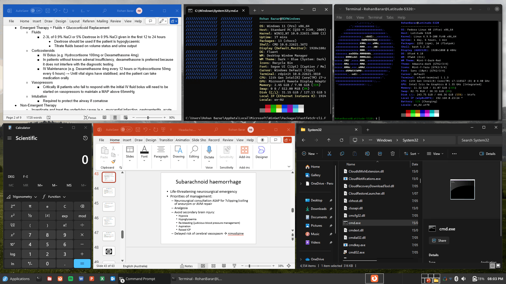

---

Run Windows applications (including [Microsoft 365](https://www.microsoft365.com/) and [Adobe Creative Cloud](https://www.adobe.com/creativecloud.html)) on GNU/Linux with `KDE Plasma`, `GNOME` or `XFCE`, integrated seamlessly as if they were native to the OS.

## Underlying Mechanism
WinApps works by:
1. Running Windows in a `Docker`, `Podman` or `libvirt` virtual machine.
2. Querying Windows for all installed applications.
3. Creating shortcuts to selected Windows applications on the host GNU/Linux OS.
4. Using [`FreeRDP`](https://www.freerdp.com/) as a backend to seamlessly render Windows applications alongside GNU/Linux applications.

## Installaiton
 For a complete Installation guide, please reffer to the [INSTALL.md](docs/INSTALL.md)

## Additional Features
- The GNU/Linux `/home` directory is accessible within Windows via the `\\tsclient\home` mount.
- Integration with `Nautilus`, allowing you to right-click files to open them with specific Windows applications based on the file MIME type.
- The [official taskbar widget](https://github.com/winapps-org/WinApps-Launcher) enables seamless administration of the Windows subsystem and offers an easy way to launch Windows applications.

## Supported Applications
**WinApps supports <u>*ALL*</u> Windows applications.**

Universal application support is achieved by:
1. Scanning Windows for any officially supported applications (list below).
2. Scanning Windows for any other `.exe` files listed within the Windows Registry.

Officially supported applications benefit from high-resolution icons and pre-populated MIME types. This enables file managers to determine which Windows applications should open files based on file extensions. Icons for other detected applications are pulled from `.exe` files.

Contributing to the list of supported applications is encouraged through submission of pull requests! Please help us grow the WinApps community.

*Please note that the provided list of officially supported applications is community-driven. As such, some applications may not be tested and verified by the WinApps team.*

### Officially Supported Applications

| Icon                                                | Application Info                                                                                                                                                                           | Icon                                                    | Application Info                                                                                                                                                                                                                   |
|-----------------------------------------------------|--------------------------------------------------------------------------------------------------------------------------------------------------------------------------------------------|---------------------------------------------------------|------------------------------------------------------------------------------------------------------------------------------------------------------------------------------------------------------------------------------------|
|  | <b>Adobe Acrobat Pro</b> (X) <i><a href="https://commons.wikimedia.org/wiki/File:Adobe_Acrobat_DC_logo_2020.svg">Icon</a> in the Public Domain.</i>                                  |    | <b>Adobe After Effects</b> (CC) <i><a href="https://commons.wikimedia.org/wiki/File:Adobe_After_Effects_CC_icon.svg">Icon</a> in the Public Domain.</i>                                                                      |
|    | <b>Adobe Audition</b> (CC) <i><a href="https://en.m.wikipedia.org/wiki/File:Adobe_Audition_CC_icon_%282020%29.svg">Icon</a> in the Public Domain.</i>                                |         | <b>Adobe Bridge</b> (CS6, CC) <i><a href="https://en.m.wikipedia.org/wiki/File:Adobe_Bridge_CC_icon.svg">Icon</a> in the Public Domain.</i>                                                                                  |
|       | <b>Adobe Creative Cloud</b> (CC) <i><a href="https://iconduck.com/icons/240218/adobe-creative-cloud">Icon</a> under <a href="https://iconduck.com/licenses/mit">MIT license</a>.</i> |     | <b>Adobe Illustrator</b> (CC) <i><a href="https://commons.wikimedia.org/wiki/File:Adobe_Illustrator_CC_icon.svg">Icon</a> in the Public Domain.</i>                                                                          |
|    | <b>Adobe InDesign</b> (CC) <i><a href="https://commons.wikimedia.org/wiki/File:Adobe_InDesign_CC_icon.svg">Icon</a> in the Public Domain.</i>                                        |       | <b>Adobe Lightroom</b> (CC) <i><a href="https://commons.wikimedia.org/wiki/File:Adobe_Photoshop_Lightroom_CC_logo.svg">Icon</a> in the Public Domain.</i>                                                                    |
|   | <b>Adobe Photoshop</b> (CS6, CC, 2022) <i><a href="https://commons.wikimedia.org/wiki/File:Adobe_Photoshop_CC_icon.svg">Icon</a> in the Public Domain.</i>                           |                | <b>Command Prompt</b> (cmd.exe) <i><a href="https://github.com/microsoft/terminal/blob/main/res/terminal/Terminal.svg">Icon</a> under <a href="https://github.com/microsoft/terminal/blob/main/LICENSE">MIT license</a>.</i> |
|       | <b>File Explorer</b> (Windows Explorer) <i><a href="https://commons.wikimedia.org/wiki/File:Windows_Explorer.svg">Icon</a> in the Public Domain.</i>                                 |          | <b>Internet Explorer</b> (11) <i><a href="https://commons.wikimedia.org/wiki/File:Internet_Explorer_10%2B11_logo.svg">Icon</a> in the Public Domain.</i>                                                                     |
|         | <b>Microsoft Access</b> (2016, 2019, o365) <i><a href="https://commons.wikimedia.org/wiki/File:Microsoft_Office_Access_(2019-present).svg">Icon</a> in the Public Domain.</i>        |              | <b>Microsoft Excel</b> (2016, 2019, o365) <i><a href="https://en.m.wikipedia.org/wiki/File:Microsoft_Office_Excel_(2019%E2%80%93present).svg">Icon</a> in the Public Domain.</i>                                             |
|           | <b>Microsoft Word</b> (2016, 2019, o365) <i><a href="https://en.m.wikipedia.org/wiki/File:Microsoft_Office_Word_(2019%E2%80%93present).svg">Icon</a> in the Public Domain.</i>       |            | <b>Microsoft OneNote</b> (2016, 2019, o365) <i><a href="https://en.m.wikipedia.org/wiki/File:Microsoft_Office_OneNote_(2019%E2%80%93present).svg">Icon</a> in the Public Domain.</i>                                         |
|        | <b>Microsoft Outlook</b> (2016, 2019, o365) <i><a href="https://en.m.wikipedia.org/wiki/File:Microsoft_Office_Outlook_(2018%E2%80%93present).svg">Icon</a> in the Public Domain.</i> |         | <b>Microsoft PowerPoint</b> (2016, 2019, o365) <i><a href="https://en.m.wikipedia.org/wiki/File:Microsoft_Office_PowerPoint_(2019%E2%80%93present).svg">Icon</a> in the Public Domain.</i>                                   |
|      | <b>Microsoft Publisher</b> (2016, 2019, o365) <i><a href="https://en.m.wikipedia.org/wiki/File:Microsoft_Office_Publisher_(2019-present).svg">Icon</a> in the Public Domain.</i>     |              | <b>Microsoft Visio</b> (Standard/Pro. 2021, Plan 2) <i><a href="https://en.m.wikipedia.org/wiki/File:Microsoft_Office_Visio_(2019).svg">Icon</a> in the Public Domain.</i>                                                   |
|        | <b>Microsoft Project</b> (Standard/Pro. 2021, Plan 3/5) <i><a href="https://en.m.wikipedia.org/wiki/File:Microsoft_Project_(2019–present).svg">Icon</a> in the Public Domain.</i>    |  | <b>Microsoft Visual Studio</b> (Comm./Pro./Ent. 2022) <i><a href="https://en.m.wikipedia.org/wiki/File:Visual_Studio_Icon_2022.svg">Icon</a> in the Public Domain.</i>                                                       |
|           | <b>mIRC</b> <i><a href="https://en.wikipedia.org/wiki/MIRC#/media/File:Mircnewlogo.png">Icon</a> in the Public Domain.</i>                                                              |         | <b>PowerShell</b> <i><a href="https://iconduck.com/icons/102322/file-type-powershell">Icon</a> under <a href="https://iconduck.com/licenses/mit">MIT license</a>.</i>                                                           |
|            | <b>Windows</b> (Full RDP Session) <i><a href="url">Icon</a> in the Public Domain.</i>                                                                                                |                                                         |                                                                                                                                                                                                                                    |

## Star History

