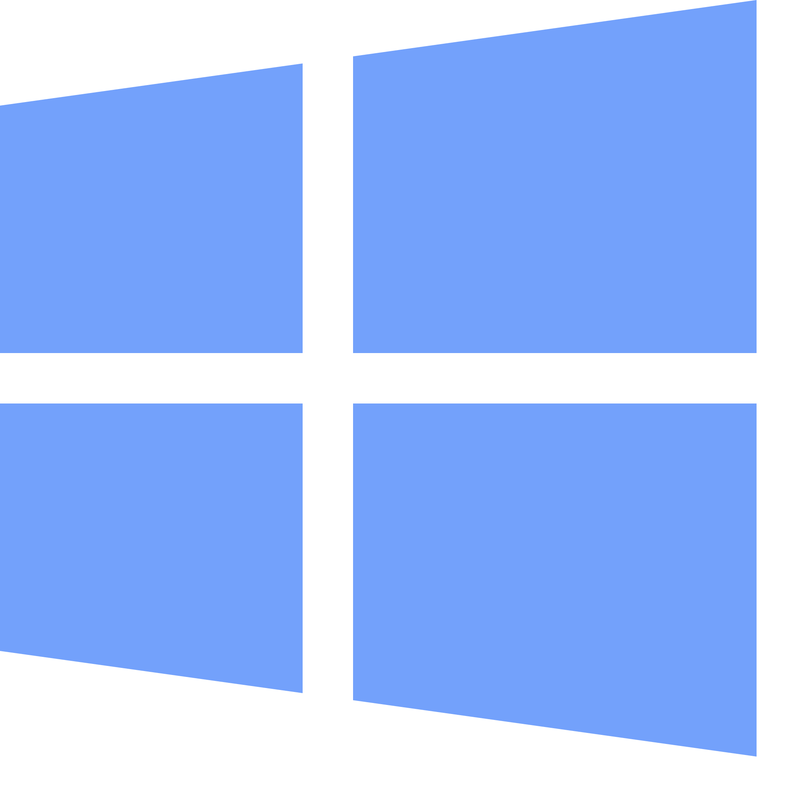

<p align="center"></p>
<p align="center"></p>
<hr>

Run Windows applications (including [Microsoft 365](https://www.microsoft365.com/) and [Adobe Creative Cloud](https://www.adobe.com/creativecloud.html)) on GNU/Linux with `KDE Plasma`, `GNOME` or `XFCE`, integrated seamlessly as if they were native to the OS.

<p align="center"></p>

## Underlying Mechanism
WinApps works by:
1. Running Windows in a `Docker`, `Podman` or `libvirt` virtual machine.
2. Querying Windows for all installed applications.
3. Creating shortcuts to selected Windows applications on the host GNU/Linux OS.
4. Using [`FreeRDP`](https://www.freerdp.com/) as a backend to seamlessly render Windows applications alongside GNU/Linux applications.

## Additional Features
- The GNU/Linux `/home` directory is accessible within Windows via the `\\tsclient\home` mount.
- Integration with `Nautilus`, allowing you to right-click files to open them with specific Windows applications based on the file MIME type.
- The [official taskbar widget](https://github.com/winapps-org/WinApps-Launcher) enables seamless administration of the Windows subsystem and offers an easy way to launch Windows applications.

## Supported Applications
**WinApps supports <u>*ALL*</u> Windows applications.**

Universal application support is achieved by:
1. Scanning Windows for any officially supported applications (list below).
2. Scanning Windows for any other `.exe` files listed within the Windows Registry.

Officially supported applications benefit from high-resolution icons and pre-populated MIME types. This enables file managers to determine which Windows applications should open files based on file extensions. Icons for other detected applications are pulled from `.exe` files.

Contributing to the list of supported applications is encouraged through submission of pull requests! Please help us grow the WinApps community.

*Please note that the provided list of officially supported applications is community-driven. As such, some applications may not be tested and verified by the WinApps team.*

### Officially Supported Applications
<table cellpadding="10" cellspacing="0" border="0">
    <tr>
        <!-- Adobe Acrobat Pro -->
        <td>
            
        </td>
        <td>
            <b>Adobe Acrobat Pro</b><br>
            (X)<br>
            <i><a href="https://commons.wikimedia.org/wiki/File:Adobe_Acrobat_DC_logo_2020.svg">Icon</a> in the Public Domain.</i>
        </td>
        <!-- Adobe After Effects -->
        <td>
            
        </td>
        <td>
            <b>Adobe After Effects</b><br>
            (CC)<br>
            <i><a href="https://commons.wikimedia.org/wiki/File:Adobe_After_Effects_CC_icon.svg">Icon</a> in the Public Domain.</i>
        </td>
    </tr>
    <tr>
        <!-- Adobe Audition -->
        <td>
            
        </td>
        <td>
            <b>Adobe Audition</b><br>
            (CC)<br>
            <i><a href="https://en.m.wikipedia.org/wiki/File:Adobe_Audition_CC_icon_%282020%29.svg">Icon</a> in the Public Domain.</i>
        </td>
        <!-- Adobe Bridge -->
        <td>
            
        </td>
        <td>
            <b>Adobe Bridge</b><br>
            (CS6, CC)<br>
            <i><a href="https://en.m.wikipedia.org/wiki/File:Adobe_Bridge_CC_icon.svg">Icon</a> in the Public Domain.</i>
        </td>
    </tr>
    <tr>
        <!-- Adobe Creative Cloud -->
        <td>
            
        </td>
        <td>
            <b>Adobe Creative Cloud</b><br>
            (CC)<br>
            <i><a href="https://iconduck.com/icons/240218/adobe-creative-cloud">Icon</a> under <a href="https://iconduck.com/licenses/mit">MIT license</a>.</i>
        </td>
        <!-- Adobe Illustrator -->
        <td>
            
        </td>
        <td>
            <b>Adobe Illustrator</b><br>
            (CC)<br>
            <i><a href="https://commons.wikimedia.org/wiki/File:Adobe_Illustrator_CC_icon.svg">Icon</a> in the Public Domain.</i>
        </td>
    </tr>
    <tr>
        <!-- Adobe InDesign -->
        <td>
            
        </td>
        <td>
            <b>Adobe InDesign</b><br>
            (CC)<br>
            <i><a href="https://commons.wikimedia.org/wiki/File:Adobe_InDesign_CC_icon.svg">Icon</a> in the Public Domain.</i>
        </td>
        <!-- Adobe Lightroom -->
        <td>
            
        </td>
        <td>
            <b>Adobe Lightroom</b><br>
            (CC)<br>
            <i><a href="https://commons.wikimedia.org/wiki/File:Adobe_Photoshop_Lightroom_CC_logo.svg">Icon</a> in the Public Domain.</i>
        </td>
    </tr>
    <tr>
        <!-- Adobe Photoshop -->
        <td>
            
        </td>
        <td>
            <b>Adobe Photoshop</b><br>
            (CS6, CC)<br>
            <i><a href="https://commons.wikimedia.org/wiki/File:Adobe_Photoshop_CC_icon.svg">Icon</a> in the Public Domain.</i>
        </td>
        <!-- Command Prompt -->
        <td>
            
        </td>
        <td>
            <b>Command Prompt</b><br>
            (cmd.exe)<br>
            <i><a href="https://github.com/microsoft/terminal/blob/main/res/terminal/Terminal.svg">Icon</a> under <a href="https://github.com/microsoft/terminal/blob/main/LICENSE">MIT license</a>.</i>
        </td>
    </tr>
    <tr>
        <!-- File Explorer -->
        <td>
            
        </td>
        <td>
            <b>File Explorer</b><br>
            (Windows Explorer)<br>
            <i><a href="https://commons.wikimedia.org/wiki/File:Windows_Explorer.svg">Icon</a> in the Public Domain.</i>
        </td>
        <!-- Internet Explorer -->
        <td>
            
        </td>
        <td>
            <b>Internet Explorer</b><br>
            (11)<br>
            <i><a href="https://commons.wikimedia.org/wiki/File:Internet_Explorer_10%2B11_logo.svg">Icon</a> in the Public Domain.</i>
        </td>
    </tr>
    <tr>
         <!-- Microsoft Access -->
        <td>
            
        </td>
        <td>
            <b>Microsoft Access</b><br>
            (2016, 2019, o365)<br>
            <i><a href="https://commons.wikimedia.org/wiki/File:Microsoft_Office_Access_(2019-present).svg">Icon</a> in the Public Domain.</i>
        </td>
        <!-- Microsoft Excel -->
        <td>
            
        </td>
        <td>
            <b>Microsoft Excel</b><br>
            (2016, 2019, o365)<br>
            <i><a href="https://en.m.wikipedia.org/wiki/File:Microsoft_Office_Excel_(2019%E2%80%93present).svg">Icon</a> in the Public Domain.</i>
        </td>
    </tr>
    <tr>
        <!-- Microsoft Word -->
        <td>
            
        </td>
        <td>
            <b>Microsoft Word</b><br>
            (2016, 2019, o365)<br>
            <i><a href="https://en.m.wikipedia.org/wiki/File:Microsoft_Office_Word_(2019%E2%80%93present).svg">Icon</a> in the Public Domain.</i>
        </td>
        <!-- Microsoft OneNote -->
        <td>
            
        </td>
        <td>
            <b>Microsoft OneNote</b><br>
            (2016, 2019, o365)<br>
            <i><a href="https://en.m.wikipedia.org/wiki/File:Microsoft_Office_OneNote_(2019%E2%80%93present).svg">Icon</a> in the Public Domain.</i>
        </td>
    </tr>
    <tr>
        <!-- Microsoft Outlook -->
        <td>
            
        </td>
        <td>
            <b>Microsoft Outlook</b><br>
            (2016, 2019, o365)<br>
            <i><a href="https://en.m.wikipedia.org/wiki/File:Microsoft_Office_Outlook_(2018%E2%80%93present).svg">Icon</a> in the Public Domain.</i>
        </td>
        <!-- Microsoft PowerPoint -->
        <td>
            
        </td>
        <td>
            <b>Microsoft PowerPoint</b><br>
            (2016, 2019, o365)<br>
            <i><a href="https://en.m.wikipedia.org/wiki/File:Microsoft_Office_PowerPoint_(2019%E2%80%93present).svg">Icon</a> in the Public Domain.</i>
            </td>
    </tr>
    <tr>
        <!-- Microsoft Publisher -->
        <td>
            
        </td>
        <td>
            <b>Microsoft Publisher</b><br>
            (2016, 2019, o365)<br>
            <i><a href="https://en.m.wikipedia.org/wiki/File:Microsoft_Office_Publisher_(2019-present).svg">Icon</a> in the Public Domain.</i>
        </td>
        <!-- Microsoft Visio -->
        <td>
            
        </td>
        <td>
            <b>Microsoft Visio</b><br>
            (Standard/Pro. 2021, Plan 2)<br>
            <i><a href="https://en.m.wikipedia.org/wiki/File:Microsoft_Office_Visio_(2019).svg">Icon</a> in the Public Domain.</i>
        </td>
    </tr>
    <tr>
        <!-- Microsoft Project -->
        <td>
            
        </td>
        <td>
            <b>Microsoft Project</b><br>
            (Standard/Pro. 2021, Plan 3/5)<br>
            <i><a href="https://en.m.wikipedia.org/wiki/File:Microsoft_Project_(2019–present).svg">Icon</a> in the Public Domain.</i>
        </td>
        <!-- Microsoft Visual Studio -->
        <td>
            
        </td>
        <td>
            <b>Microsoft Visual Studio</b><br>
            (Comm./Pro./Ent. 2022)<br>
            <i><a href="https://en.m.wikipedia.org/wiki/File:Visual_Studio_Icon_2022.svg">Icon</a> in the Public Domain.</i>
        </td>
    </tr>
    <tr>
        <!-- PowerShell -->
        <td>
            
        </td>
        <td>
            <b>PowerShell</b><br>
            <i><a href="https://iconduck.com/icons/102322/file-type-powershell">Icon</a> under <a href="https://iconduck.com/licenses/mit">MIT license</a>.</i>
        </td>
        <!-- Windows -->
        <td>
            
        </td>
        <td>
            <b>Windows</b><br>
            (Full RDP Session)<br>
            <i><a href="url">Icon</a> in the Public Domain.</i>
        </td>
    </tr>
</table>

## Installation
### Step 1: Configure a Windows VM
Both `Docker` and `Podman` are recommended backends for running the Windows virtual machine, as they facilitate an automated Windows installation process. WinApps is also compatible with `libvirt`. While this method requires considerably more manual configuration, it also provides greater virtual machine customisation options. All three methods leverage the `KVM` hypervisor, ensuring excellent virtual machine performance. Ultimately, the choice of backend depends on your specific use case.

The following guides are available:
- [Creating a Windows VM with `Docker` or `Podman`](docs/docker.md)
- [Creating a Windows VM with `libvirt`](docs/libvirt.md)

If you already have a Windows VM or server you wish to use with WinApps, you will need to merge `install/RDPApps.reg` into the Windows Registry manually.

### Step 2: Install Dependencies
Install the required dependencies.
  - Debian/Ubuntu:
      ```bash
      sudo apt install -y dialog freerdp3-x11 iproute2 libnotify-bin netcat-openbsd
      ```
  - Fedora/RHEL:
      ```bash
      sudo dnf install -y dialog freerdp iproute libnotify nmap-ncat
      ```
  - Arch Linux:
      ```bash
      sudo pacman -Syu --needed -y dialog freerdp iproute2 libnotify gnu-netcat
      ```
  - Gentoo Linux:
      ```bash
      sudo emerge --ask=n dev-util/dialog net-misc/freerdp:3 sys-apps/iproute2 x11-libs/libnotify net-analyzer/openbsd-netcat
      ```

> [!NOTE]
> WinApps requires `FreeRDP` version 3 or later. If not available for your distribution through your package manager, you can install the [Flatpak](https://flathub.org/apps/com.freerdp.FreeRDP):
> ```bash
> flatpak install flathub com.freerdp.FreeRDP
> sudo flatpak override --filesystem=home com.freerdp.FreeRDP # To use `+home-drive`
> ```
> However, if you have weird issues like [#233](https://github.com/winapps-org/winapps/issues/233) when running Flatpak, please compile FreeRDP from source according to [this guide](https://github.com/FreeRDP/FreeRDP/wiki/Compilation).

### Step 3: Create a WinApps Configuration File
Create a configuration file at `~/.config/winapps/winapps.conf` containing the following:
```bash
##################################
#   WINAPPS CONFIGURATION FILE   #
##################################

# INSTRUCTIONS
# - Leading and trailing whitespace are ignored.
# - Empty lines are ignored.
# - Lines starting with '#' are ignored.
# - All characters following a '#' are ignored.

# [WINDOWS USERNAME]
RDP_USER="MyWindowsUser"

# [WINDOWS PASSWORD]
RDP_PASS="MyWindowsPassword"

# [WINDOWS DOMAIN]
# DEFAULT VALUE: '' (BLANK)
RDP_DOMAIN=""

# [WINDOWS IPV4 ADDRESS]
# NOTES:
# - If using 'libvirt', 'RDP_IP' will be determined by WinApps at runtime if left unspecified.
# DEFAULT VALUE:
# - 'docker': '127.0.0.1'
# - 'podman': '127.0.0.1'
# - 'libvirt': '' (BLANK)
RDP_IP=""

# [WINAPPS BACKEND]
# DEFAULT VALUE: 'docker'
# VALID VALUES:
# - 'docker'
# - 'podman'
# - 'libvirt'
# - 'manual'
WAFLAVOR="docker"

# [DISPLAY SCALING FACTOR]
# NOTES:
# - If an unsupported value is specified, a warning will be displayed.
# - If an unsupported value is specified, WinApps will use the closest supported value.
# DEFAULT VALUE: '100'
# VALID VALUES:
# - '100'
# - '140'
# - '180'
RDP_SCALE="100"

# [ADDITIONAL FREERDP FLAGS & ARGUMENTS]
# DEFAULT VALUE: '/cert:tofu /sound /microphone'
# VALID VALUES: See https://github.com/awakecoding/FreeRDP-Manuals/blob/master/User/FreeRDP-User-Manual.markdown
RDP_FLAGS="/cert:tofu /sound /microphone"

# [MULTIPLE MONITORS]
# NOTES:
# - If enabled, a FreeRDP bug *might* produce a black screen.
# DEFAULT VALUE: 'false'
# VALID VALUES:
# - 'true'
# - 'false'
MULTIMON="false"

# [DEBUG WINAPPS]
# NOTES:
# - Creates and appends to ~/.local/share/winapps/winapps.log when running WinApps.
# DEFAULT VALUE: 'true'
# VALID VALUES:
# - 'true'
# - 'false'
DEBUG="true"

# [AUTOMATICALLY PAUSE WINDOWS]
# NOTES:
# - This is currently INCOMPATIBLE with 'docker' and 'manual'.
# - See https://github.com/dockur/windows/issues/674
# DEFAULT VALUE: 'off'
# VALID VALUES:
# - 'on'
# - 'off'
AUTOPAUSE="off"

# [AUTOMATICALLY PAUSE WINDOWS TIMEOUT]
# NOTES:
# - This setting determines the duration of inactivity to tolerate before Windows is automatically paused.
# - This setting is ignored if 'AUTOPAUSE' is set to 'off'.
# - The value must be specified in seconds (to the nearest 10 seconds e.g., '30', '40', '50', etc.).
# - For RemoteApp RDP sessions, there is a mandatory 20-second delay, so the minimum value that can be specified here is '20'.
# - Source: https://techcommunity.microsoft.com/t5/security-compliance-and-identity/terminal-services-remoteapp-8482-session-termination-logic/ba-p/246566
# DEFAULT VALUE: '300'
# VALID VALUES: >=20
AUTOPAUSE_TIME="300"

# [FREERDP COMMAND]
# NOTES:
# - WinApps will attempt to automatically detect the correct command to use for your system.
# DEFAULT VALUE: '' (BLANK)
# VALID VALUES: The command required to run FreeRDPv3 on your system (e.g., 'xfreerdp', 'xfreerdp3', etc.).
FREERDP_COMMAND=""
```

> [!NOTE]
> `RDP_USER` and `RDP_PASS` must correspond to a complete Windows user account and password, such as those created during Windows setup or for a domain user. User/PIN combinations are not valid for RDP access.

> [!NOTE]
> If you wish to use an alternative WinApps backend (other than `Docker`), uncomment and change `WAFLAVOR="docker"` to `WAFLAVOR="podman"` or `WAFLAVOR="libvirt"`.

#### Configuration Options Explained
- If using a pre-existing Windows RDP server on your LAN, you must use `RDP_IP` to specify the location of the Windows server. You may also wish to configure a static IP address for this server.
- If running a Windows VM using `libvirt` with NAT enabled, leave `RDP_IP` commented out and WinApps will auto-detect the local IP address for the VM.
- For domain users, you can uncomment and change `RDP_DOMAIN`.
- On high-resolution (UHD) displays, you can set `RDP_SCALE` to the scale you would like to use (100, 140 or 180).
- To add additional flags to the FreeRDP call (e.g. `/prevent-session-lock 120`), uncomment and use the `RDP_FLAGS` configuration option.
- For multi-monitor setups, you can try enabling `MULTIMON`. A FreeRDP bug may result in a black screen however, in which case you should revert this change.
- If you enable `DEBUG`, a log will be created on each application start in `~/.local/share/winapps/winapps.log`.
- If using a system on which the FreeRDP command is not `xfreerdp` or `xfreerdp3`, the correct command can be specified using `FREERDP_COMMAND`.

### Step 4: Run the WinApps Installer
Run the WinApps installer.
```bash
bash <(curl https://raw.githubusercontent.com/winapps-org/winapps/main/setup.sh)
```

A list of supported additional arguments can be accessed by running `./setup.sh --help`.


## Adding Additional Pre-defined Applications
Adding your own applications with custom icons and MIME types to the installer is easy. Simply copy one of the application configurations in the `apps` folder located within the WinApps repository, and:
1. Modify the name and variables to reflect the appropriate/desired values for your application.
2. Replace `icon.svg` with an SVG for your application (ensuring the icon is appropriately licensed).
3. Remove and reinstall WinApps.
4. Submit a pull request to add your application to WinApps as an officially supported application once you have tested and verified your configuration (optional, but encouraged).

## Running Applications Manually
WinApps offers a manual mode for running applications that were not configured by the WinApps installer. This is completed with the `manual` flag. Executables that are in the Windows PATH do not require full path definition.

```bash
winapps manual "C:\my\directory\executableNotInPath.exe"
winapps manual executableInPath.exe
```

## Updating WinApps
The installer can be run multiple times. To update your installation of WinApps:
1. Run the WinApps installer to remove WinApps from your system.
2. Pull the latest changes from the WinApps GitHub repository.
3. Re-install WinApps using the WinApps installer by running `winapps-setup`.

## Installation using Nix

First, follow Step 1 of the normal installation guide to create your VM.
Then, install WinApps according to the following instructions.

After installation, it will be available under `winapps`, with the installer being available under `winapps-setup`
and the optional launcher being available under `winapps-launcher.`

### Using standalone Nix

First, make sure Flakes and the `nix` command are enabled.
In your `~/.config/nix/nix.conf`:
```
experimental-features = nix-command flakes
```

```bash
nix profile install github:winapps-org/winapps#winapps
nix profile install github:winapps-org/winapps#winapps-launcher # optional
```

### On NixOS using Flakes

```nix
# flake.nix
{
  description = "My configuration";

  inputs = {
    nixpkgs.url = "github:NixOS/nixpkgs/nixos-unstable";

    winapps = {
      url = "github:winapps-org/winapps";
      inputs.nixpkgs.follows = "nixpkgs";
    };
  };

  outputs =
    {
      nixpkgs,
      winapps,
      ...
    }:
    {
      nixosConfigurations.hostname = nixpkgs.lib.nixosSystem rec {
        system = "x86_64-linux";

        modules = [
          ./configuration.nix
          (
            { pkgs, ... }:
            {
              environment.systemPackages = [
                winapps.packages.${system}.winapps
                winapps.packages.${system}.winapps-launcher # optional
              ];
            }
          )
        ];
      };
    };
}
```

### On NixOS without Flakes

[Flakes aren't real and they can't hurt you.](https://jade.fyi/blog/flakes-arent-real/).
However, if you still don't want to use flakes, you can use WinApps with flake-compat like:

```nix
# configuration.nix
{ ... }:
{

  environment.systemPackages =
    let
      winapps =
        (import (builtins.fetchTarball "https://github.com/winapps-org/winapps/archive/main.tar.gz"))
        .packages."${system}";
    in
    [
      winapps.winapps
      winapps.winapps-launcher # optional
    ];
}
```

## Star History
<a href="https://star-history.com/#winapps-org/winapps&Date">
 <picture>
   <source media="(prefers-color-scheme: dark)" srcset="https://api.star-history.com/svg?repos=winapps-org/winapps&type=Date&theme=dark"/>
   <source media="(prefers-color-scheme: light)" srcset="https://api.star-history.com/svg?repos=winapps-org/winapps&type=Date"/>
   
 </picture>
</a>
