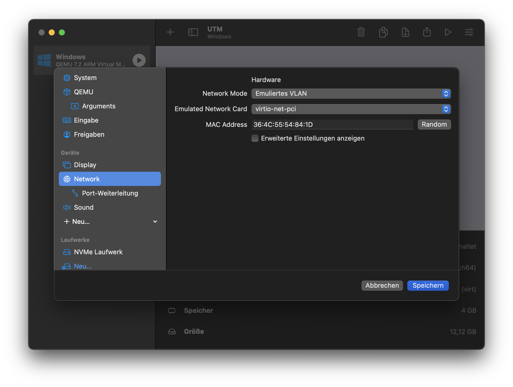
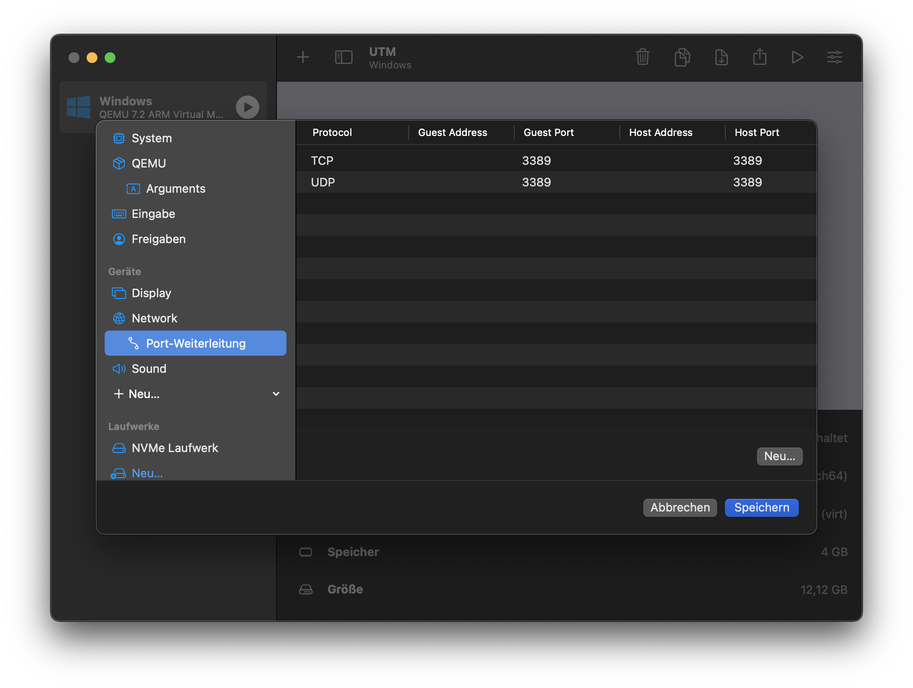

# Creating a Virtual Machine using UTM
This guide is a rough guideline what changes need to made to a normal Windows VM in UTM so it works with Quickemu.

## Install UTM and create a VM
First, get UTM from https://mac.getutm.app. Also get CrystalFetch from the Mac App Store ([this link will open it in the App Store for you](https://mac.getutm.app/crystalfetch/)).
Now, follow the "Create new VM" wizard to create your Windows VM. When prompted for a Windows ISO image, point it to the file you downloaded using CrystalFetch.

> **Note**:
> When getting the Windows image, make sure to select Windows 10/11 Professional.
> **Home will not suffice as RDP is not available there**

## Make the required changes to the VM configuration
> Note:
> There's probably a better way to do this, but I don't know how
> Also, the text in the screenshots is partially in German since
> apparently there's no way to change the display language in UTM
 
Open up the VM options.   
Now go to the network tab and select "Emulated VLAN".

A new tab in the sidebar under Network "Port Forwarding" will open up.
Add 2 Entries: One for UDP Port 3389 and one for TCP 3389.
Leave the Guest address and the Host address empty.

Once that's done, start the VM and go through the setup process as you would set up any Windows machine.

## Set up RDP on the VM

Once you finish the install, you will need to make some registry changes to enable RDP Applications to run on the system. Start by downloading the [RDPApps.reg](/install/RDPApps.reg) file, right clicking on the `Raw` button, and clicking on `Save target as`.

Once you have downloaded the registry file, right click on it, and choose `Merge`, then accept any confirmations along the way.

Next up, we need to rename the VM so that WinApps can locate it. Go to the start menu and type `About` to bring up the `About your PC` settings.

Scroll down and click on `Rename this PC`

Rename to `RDPWindows`, and then `Next`, but **do not** restart.

Lastly, scroll down to `Remote Desktop`, and toggle `Enable Remote Desktop` on, and `Confirm`.

At this point you will need to restart and you have completed your setup.

Rather than restart you can go right ahead and install other applications like Microsoft Office or Adobe CC that could be used through WinApps.

You may also wish to install the [Spice Guest Tools](https://www.spice-space.org/download/windows/spice-guest-tools/spice-guest-tools-latest.exe) inside the VM which enables features like auto-desktop resize and cut-and-paste when using `virt-manager`. As WinApps uses RDP, this is not necessary if you do not plan to access the machine via `virt-manager`.

Once you are finished, restart the VM, but do not log in. Simply close the VM viewer, and close the Virtual Machine Manager.

