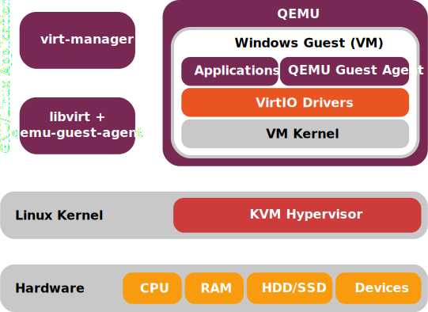
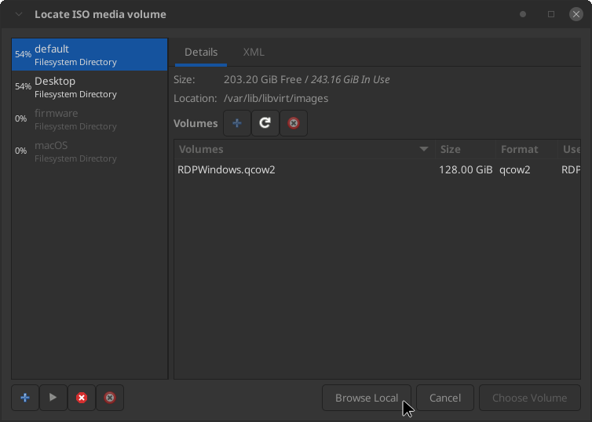
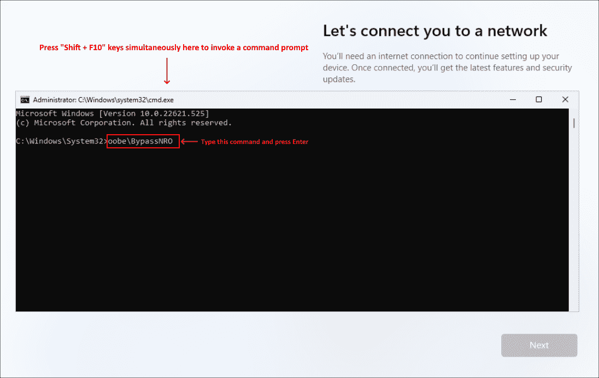
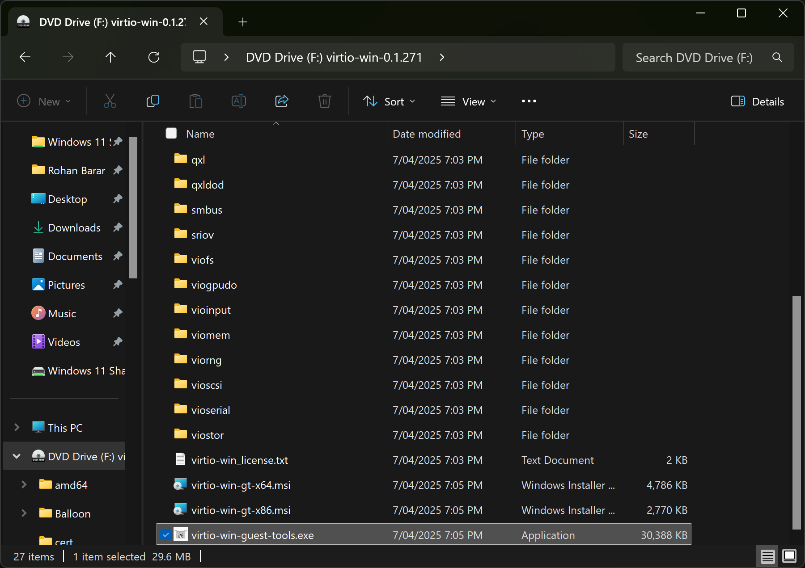
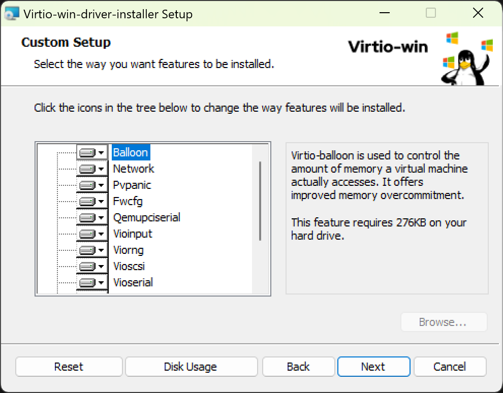
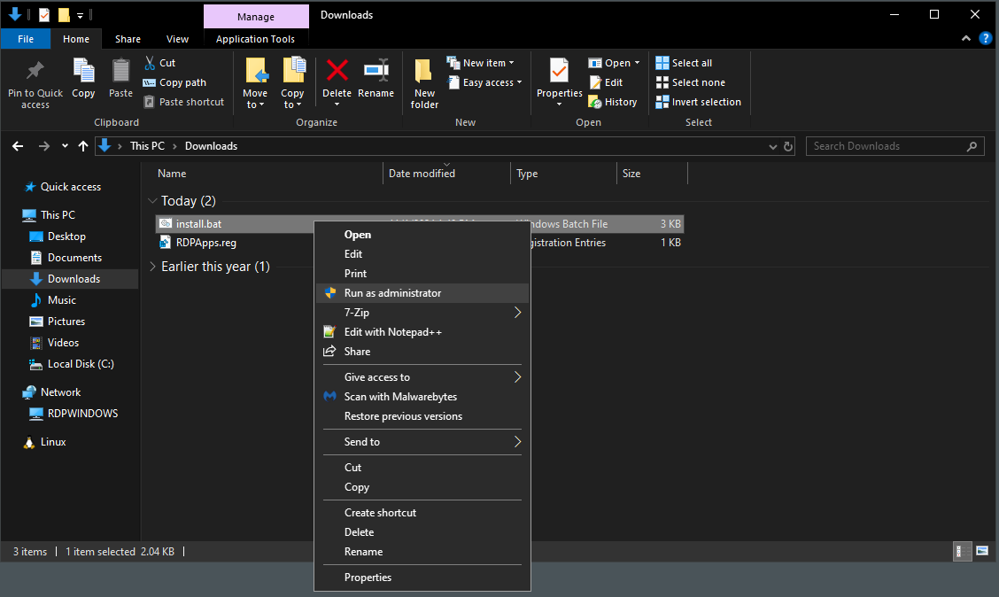

# Creating a `libvirt` Windows VM
## Understanding The Virtualisation Stack
This method of configuring a Windows virtual machine for use with WinApps is significantly more involved than utilising `Docker` or `Podman`. Nevertheless, expert users may prefer this method due to its greater flexibility and wider range of customisation options.

Before beginning, it is important to have a basic understanding of the various components involved in this particular method.

1. `QEMU` is a FOSS emulator that performs hardware virtualisation, enabling operating systems and applications designed for one architecture (e.g., aarch64) to run on systems with differing architectures (e.g., amd64). When used in conjunction with `KVM`, it can run virtual machines at near-native speed (provided the guest virtual machine matches the host architecture) by utilising hardware extensions like Intel VT-x or AMD-V.
2. `KVM` is a Linux kernel module that enables the kernel to function as a type-1 hypervisor. `KVM` runs directly on the underlying hardware (as opposed to on top of the GNU/Linux host OS). For many workloads, the performance overhead is minimal, often in the range of 2-5%. `KVM` requires a CPU with hardware virtualisation extensions.
3. `libvirt` is an open-source API, daemon, and management tool for orchestrating platform virtualisation. It provides a consistent and stable interface for managing various virtualisation technologies, including `KVM` and `QEMU` (as well as others). `libvirt` offers a wide range of functionality to control the lifecycle of virtual machines, storage, networks, and interfaces, making it easier to interact with virtualisation capabilities programmatically or via command-line tools.
4. `virt-manager` (Virtual Machine Manager) is a GUI desktop application that provides an easy-to-use interface for creating, configuring and controlling virtual machines. `virt-manager`  utilises `libvirt` as a backend.

Together, these components form a powerful and flexible virtualization stack, with `KVM` providing low-level kernel-based virtualisation capabilities, `QEMU` providing high-level userspace-based virtualisation functionality, `libvirt` managing the resources and `virt-manager` offering an intuitive graphical management interface.

<p align="center">
    
</p>

## Prerequisites
1. Ensure your CPU supports hardware virtualisation extensions by [reading this article](https://wiki.archlinux.org/title/KVM).

2. Install all dependencies by installing `virt-manager`. This will ensure that your package manager automatically installs all the necessary components.
    ```bash
    sudo apt install virt-manager # Debian/Ubuntu
    sudo dnf install virt-manager # Fedora/RHEL
    sudo pacman -S virt-manager # Arch Linux
    sudo emerge app-emulation/virt-manager # Gentoo Linux
    ```

3. Configure `libvirt` to use the 'system' URI by adding the line `LIBVIRT_DEFAULT_URI="qemu:///system"` to your preferred shell profile file (e.g., `.bashrc`, `.zshrc`, etc.).
    ```bash
    echo 'export LIBVIRT_DEFAULT_URI="qemu:///system"' >> ~/.bashrc
    ```

> [!NOTE]
> WinApps may not read your shell's configuration. If you're having issues getting the installer to detect your VM, try adding
> `LIBVIRT_DEFAULT_URI="qemu:///system"` to your `/etc/environment` like:
> ```bash
> echo 'LIBVIRT_DEFAULT_URI="qemu:///system"' | sudo tee -a /etc/environment
> ```
> Thanks to imoize for pointing this out: https://github.com/winapps-org/winapps/issues/310#issuecomment-2505348088

4. Configure rootless `libvirt` and `kvm` by adding your user to groups of the same name.
    ``` bash
    sudo usermod -a -G kvm $(id -un) # Add the user to the 'kvm' group.
    sudo usermod -a -G libvirt $(id -un) # Add the user to the 'libvirt' group.
    sudo reboot # Reboot the system to ensure the user is added to the relevant groups.
    ```

    Note: On NixOS, the group name for libvirt is `libvirtd` and not `libvirt`. In addition, user and group management on NixOS is handled through the Nix configuration files and not via traditional tools like `usermod`. Please see "Adding User to a group" on [this NixOS Wiki page](https://wiki.nixos.org/wiki/User_management).

    Note: Due to a known bug in `rpm-ostree`, which affects various distributions such as Silverblue, Bazzite, Bluefin, Kinoite, Aurora, UCore, and others, the commands provided earlier may not properly add your user to all required groups. If the `groups $USER` command does not show your user as being part of the necessary groups, you'll need to manually add these groups to `/etc/group` if they are present in `/usr/lib/group`.

    To resolve this:
    1. Identify which groups are missing from the output of `groups $USER`.
    2. Use the following snippet to add each missing group to `/etc/group`. Ensure you replace "kvm" with the name of the missing group.

        ```bash
        grep -E '^kvm:' /usr/lib/group | sudo tee -a /etc/group
        sudo usermod -aG kvm $USER
        ```

    3. Reboot your system to ensure that the user is correctly added to the relevant groups.

5. If relevant to your distribution, disable `AppArmor` for the `libvirt` daemon.
    ``` bash
    sudo ln -s /etc/apparmor.d/usr.sbin.libvirtd /etc/apparmor.d/disable/ # Disable AppArmor for the libvirt daemon by creating a symbolic link.
    ```

> [!NOTE]
> Systems with `SELinux` may also require security policy adjustments if virtual machine images are stored outside the default `/var/lib/libvirt/images` directory. Read [this guide](https://docs.redhat.com/en/documentation/red_hat_enterprise_linux/5/html/virtualization/sect-virtualization-security_for_virtualization-selinux_and_virtualization#sect-Virtualization-Security_for_virtualization-SELinux_and_virtualization) for more information.

6. Download a [Windows 10](https://www.microsoft.com/software-download/windows10ISO) or [Windows 11](https://www.microsoft.com/software-download/windows11) installation `.ISO` image.

> [!IMPORTANT]
> 'Professional', 'Enterprise' or 'Server' editions of Windows are required to run RDP applications. Windows 'Home' will NOT suffice.

7. Download [VirtIO drivers](https://fedorapeople.org/groups/virt/virtio-win/direct-downloads/latest-virtio/virtio-win.iso) for the Windows virtual machine.

> [!NOTE]
> VirtIO drivers enhance system performance and minimize overhead by enabling the Windows virtual machine to use specialised network and disk device drivers. These drivers are aware that they are operating inside a virtual machine, and cooperate with the hypervisor. This approach eliminates the need for the hypervisor to emulate physical hardware devices, which is a computationally expensive process. This setup allows guests to achieve high-performance network and disk operations, leveraging the benefits of paravirtualisation.
> The above link contains the latest release of the `VirtIO` drivers for Windows, compiled and signed by Red Hat. Older versions of the `VirtIO` drivers can be downloaded [here](https://fedorapeople.org/groups/virt/virtio-win/direct-downloads/archive-virtio/?C=M;O=D).
> You can read more about `VirtIO` [here](https://wiki.libvirt.org/Virtio.html) and [here](https://developer.ibm.com/articles/l-virtio/).

## Creating a Windows VM
1. Open `virt-manager`.

> [!NOTE]
> The name given to the application can vary between GNU/Linux distributions (e.g., 'Virtual Machines', 'Virtual Machine Manager', etc.)

<p align="center">
    
</p>

2. Navigate to `Edit`&rarr;`Preferences`. Ensure `Enable XML editing` is enabled, then click the `Close` button.

<p align="center">
    
</p>

3. Create a new virtual machine by clicking the `+` button.

<p align="center">
    
</p>

4. Choose `Local install media` and click `Forward`.

<p align="center">
    
</p>

5. Select the location of your Windows 10 or 11 `.ISO` by clicking `Browse...` and `Browse Local`. Ensure `Automatically detect from the installation media / source` is enabled.

<p align="center">
    
    
</p>

6. Configure the RAM and CPU cores allocated to the Windows virtual machine. We recommend `2` CPUs and `4096MB` of RAM. We will use the `VirtIO` Memory Ballooning service, which means the virtual machine can use up to `4096MB` of memory, but it will only consume this amount if necessary.

<p align="center">
    
</p>

7. Configure the virtual disk by setting its maximum size. While this size represents the largest it can grow to, the disk will only use this space as needed.

<p align="center">
    
</p>

8. Name your virtual machine `RDPWindows` to ensure it is recognized by WinApps, and select the option to `Customize configuration before installation`.

<p align="center">
    
</p>

> [!NOTE]
> A name other than `RDPWindows` can be used if `VM_NAME` is set in `~/.config/winapps/winapps.conf`.

9. After clicking `Finish`, select `Copy host CPU configuration` under 'CPUs', and then click `Apply`.

> [!NOTE]
> Sometimes this feature gets disabled after installing Windows. Make sure to check and re-enable this option after the installation is complete.

<p align="center">
    
</p>

10. (Optional) Assign specific physical CPU cores to the virtual machine. This can improve performance by reducing context switching and ensuring that the virtual machine's workload consistently uses the same cores, leading to better CPU cache utilisation.
    1. Run `lscpu -e` to determine which L1, L2 and L3 caches are associated with which CPU cores.

        Example 1 (Intel 11th Gen Core i7-1185G7):
        ```
        CPU NODE SOCKET CORE L1d:L1i:L2:L3 ONLINE    MAXMHZ   MINMHZ
          0    0      0    0 0:0:0:0          yes 4800.0000 400.0000
          1    0      0    1 1:1:1:0          yes 4800.0000 400.0000
          2    0      0    2 2:2:2:0          yes 4800.0000 400.0000
          3    0      0    3 3:3:3:0          yes 4800.0000 400.0000
          4    0      0    0 0:0:0:0          yes 4800.0000 400.0000
          5    0      0    1 1:1:1:0          yes 4800.0000 400.0000
          6    0      0    2 2:2:2:0          yes 4800.0000 400.0000
          7    0      0    3 3:3:3:0          yes 4800.0000 400.0000
        ```

        - C<sub>0</sub> = T<sub>0</sub>+T<sub>4</sub> &rarr; L1<sub>0</sub>+L2<sub>0</sub>+L3<sub>0</sub>
        - C<sub>1</sub> = T<sub>1</sub>+T<sub>5</sub> &rarr; L1<sub>1</sub>+L2<sub>1</sub>+L3<sub>0</sub>
        - C<sub>2</sub> = T<sub>2</sub>+T<sub>6</sub> &rarr; L1<sub>2</sub>+L2<sub>2</sub>+L3<sub>0</sub>
        - C<sub>3</sub> = T<sub>3</sub>+T<sub>7</sub> &rarr; L1<sub>3</sub>+L2<sub>3</sub>+L3<sub>0</sub>

        Example 2 (AMD Ryzen 5 1600):
        ```
        CPU NODE SOCKET CORE L1d:L1i:L2:L3 ONLINE MAXMHZ    MINMHZ
        0   0    0      0    0:0:0:0       yes    3800.0000 1550.0000
        1   0    0      0    0:0:0:0       yes    3800.0000 1550.0000
        2   0    0      1    1:1:1:0       yes    3800.0000 1550.0000
        3   0    0      1    1:1:1:0       yes    3800.0000 1550.0000
        4   0    0      2    2:2:2:0       yes    3800.0000 1550.0000
        5   0    0      2    2:2:2:0       yes    3800.0000 1550.0000
        6   0    0      3    3:3:3:1       yes    3800.0000 1550.0000
        7   0    0      3    3:3:3:1       yes    3800.0000 1550.0000
        8   0    0      4    4:4:4:1       yes    3800.0000 1550.0000
        9   0    0      4    4:4:4:1       yes    3800.0000 1550.0000
        10  0    0      5    5:5:5:1       yes    3800.0000 1550.0000
        11  0    0      5    5:5:5:1       yes    3800.0000 1550.0000
        ```

        - C<sub>0</sub> = T<sub>0</sub>+T<sub>1</sub> &rarr; L1<sub>0</sub>+L2<sub>0</sub>+L3<sub>0</sub>
        - C<sub>1</sub> = T<sub>2</sub>+T<sub>3</sub> &rarr; L1<sub>1</sub>+L2<sub>1</sub>+L3<sub>0</sub>
        - C<sub>2</sub> = T<sub>4</sub>+T<sub>5</sub> &rarr; L1<sub>2</sub>+L2<sub>2</sub>+L3<sub>0</sub>
        - C<sub>3</sub> = T<sub>6</sub>+T<sub>7</sub> &rarr; L1<sub>3</sub>+L2<sub>3</sub>+L3<sub>1</sub>
        - C<sub>4</sub> = T<sub>8</sub>+T<sub>9</sub> &rarr; L1<sub>4</sub>+L2<sub>4</sub>+L3<sub>1</sub>
        - C<sub>5</sub> = T<sub>10</sub>+T<sub>11</sub> &rarr; L1<sub>5</sub>+L2<sub>5</sub>+L3<sub>1</sub>

    2. Select which CPU cores to 'pin'. You should aim to select a combination of CPU cores that minimises sharing of caches between Windows and GNU/Linux.

        Example 1:
        - CPU cores share the same singular L3 cache, so this cannot be optimised.
        - CPU cores utilise different L1 and L2 caches, so isolating corresponding thread pairs will help improve performance.
        - Thus, if limiting the virtual machine to a maximum of 4 threads, there are 10 possible optimal configurations:
            - T<sub>0</sub>+T<sub>4</sub>
            - T<sub>1</sub>+T<sub>5</sub>
            - T<sub>2</sub>+T<sub>6</sub>
            - T<sub>3</sub>+T<sub>7</sub>
            - T<sub>0</sub>+T<sub>4</sub>+T<sub>1</sub>+T<sub>5</sub>
            - T<sub>0</sub>+T<sub>4</sub>+T<sub>2</sub>+T<sub>6</sub>
            - T<sub>0</sub>+T<sub>4</sub>+T<sub>3</sub>+T<sub>7</sub>
            - T<sub>1</sub>+T<sub>5</sub>+T<sub>2</sub>+T<sub>6</sub>
            - T<sub>1</sub>+T<sub>5</sub>+T<sub>3</sub>+T<sub>7</sub>
            - T<sub>2</sub>+T<sub>6</sub>+T<sub>3</sub>+T<sub>7</sub>

        Example 2:
        - Threads 0-5 utilise one L3 cache whereas threads 6-11 utilise a different L3 cache. Thus, one of these two sets of threads should be pinned to the virtual machine.
        - Pinning and isolating fewer than these (e.g. threads 8-11) would result in the host system making use of the L3 cache in threads 6 and 7, resulting in cache evictions and therefore bad performance.
        - Thus, there are only two possible optimal configurations:
            - T<sub>0</sub>+T<sub>1</sub>+T<sub>2</sub>+T<sub>3</sub>+T<sub>4</sub>+T<sub>5</sub>
            - T<sub>6</sub>+T<sub>7</sub>+T<sub>8</sub>+T<sub>9</sub>+T<sub>10</sub>+T<sub>11</sub>

    3. Prepare and add/modify the following to the `<vcpu>`, `<cputune>` and `<cpu>` sections, adjusting the values to match your selected threads.

        Example 1: The following selects 'T<sub>2</sub>+T<sub>6</sub>+T<sub>3</sub>+T<sub>7</sub>'.

        ```xml
        <vcpu placement="static">4</vcpu>
        <cputune>
            <vcpupin vcpu="0" cpuset="2"/>
            <vcpupin vcpu="1" cpuset="6"/>
            <vcpupin vcpu="2" cpuset="3"/>
            <vcpupin vcpu="3" cpuset="7"/>
        </cputune>
        <cpu mode="host-passthrough" check="none" migratable="on">
            <topology sockets="1" dies="1" clusters="1" cores="2" threads="2"/>
        </cpu>
        ```

        Example 2: The following selects 'T<sub>6</sub>+T<sub>7</sub>+T<sub>8</sub>+T<sub>9</sub>+T<sub>10</sub>+T<sub>11</sub>'.

        ```xml
        <vcpu placement="static">6</vcpu>
        <cputune>
            <vcpupin vcpu="0" cpuset="6"/>
            <vcpupin vcpu="1" cpuset="7"/>
            <vcpupin vcpu="2" cpuset="8"/>
            <vcpupin vcpu="3" cpuset="9"/>
            <vcpupin vcpu="4" cpuset="10"/>
            <vcpupin vcpu="5" cpuset="11"/>
        </cputune>
        <cpu mode="host-passthrough" check="none" migratable="on">
            <topology sockets="1" dies="1" clusters="1" cores="3" threads="2"/>
        </cpu>
        ```

> [!NOTE]
> More information on configuring CPU pinning can be found in [this excellent guide](https://wiki.archlinux.org/title/PCI_passthrough_via_OVMF#CPU_pinning).

11. Navigate to the `XML` tab, and edit the `<clock>` section to disable all timers except for the hypervclock, thereby drastically reducing idle CPU usage. Once changed, click `Apply`.
    ```xml
    <clock offset='localtime'>
      <timer name='rtc' present='no' tickpolicy='catchup'/>
      <timer name='pit' present='no' tickpolicy='delay'/>
      <timer name='hpet' present='no'/>
      <timer name='kvmclock' present='no'/>
      <timer name='hypervclock' present='yes'/>
    </clock>
    ```

<p align="center">
    
</p>

12. Enable Hyper-V enlightenments by adding the following to the `<hyperv>` section. Once changed, click `Apply`.

    ```xml
    <hyperv>
      <relaxed state='on'/>
      <vapic state='on'/>
      <spinlocks state='on' retries='8191'/>
      <vpindex state='on'/>
      <synic state='on'/>
      <stimer state='on'>
        <direct state='on'/>
      </stimer>
      <reset state='on'/>
      <frequencies state='on'/>
      <reenlightenment state='on'/>
      <tlbflush state='on'/>
      <ipi state='on'/>
    </hyperv>
    ```

> [!NOTE]
> Hyper-V enlightenments make Windows (and other Hyper-V guests) think they are running on top of a Hyper-V compatible hypervisor. This enables use of Hyper-V specific features, allowing `KVM` to implement paravirtualised interfaces for improved virtual machine performance.

13. Add the following XML snippet within the `<devices>` section to enable the GNU/Linux host to communicate with Windows using `QEMU Guest Agent`.

    ```xml
    <channel type='unix'>
      <source mode='bind'/>
      <target type='virtio' name='org.qemu.guest_agent.0'/>
      <address type='virtio-serial' controller='0' bus='0' port='2'/>
    </channel>
    ```

14. In the 'Memory' section, set the `Current allocation` to the minimum amount of memory you want the virtual machine to use, with a recommended value of `1024MB`.

<p align="center">
    
</p>

15. (Optional) Under `Boot Options`, enable `Start virtual machine on host boot up`.

<p align="center">
    
</p>

16. Navigate to 'SATA Disk 1' and set the `Disk bus` type to `VirtIO`. This allows disk access to be paravirtualised, improving virtual machine performance.

<p align="center">
    
</p>

17. Navigate to 'NIC' and set the `Device model` type to `virtio` to enable paravirtualised networking.

<p align="center">
    
</p>

18. Click the `Add Hardware` button in the lower left, and choose `Storage`. For `Device type`, select `CDROM device` and choose the VirtIO driver `.ISO` you downloaded earlier. Click `Finish` to add the new CD-ROM device.

> [!IMPORTANT]
> If you skip this step, the Windows installer will fail to recognise and list the virtual hard drive you created earlier.

<p align="center">
    
</p>

19. Click `Begin Installation` in the top left.

<p align="center">
    
</p>

### Example `.XML` File
Below is an example `.XML` file that describes a Windows 11 virtual machine.

```xml
<domain type="kvm">
  <name>RDPWindows</name>
  <uuid>4d76e36e-c632-43e0-83c0-dc9f36c2823a</uuid>
  <metadata>
    <libosinfo:libosinfo xmlns:libosinfo="http://libosinfo.org/xmlns/libvirt/domain/1.0">
      <libosinfo:os id="http://microsoft.com/win/11"/>
    </libosinfo:libosinfo>
  </metadata>
  <memory unit="KiB">8388608</memory>
  <currentMemory unit="KiB">8388608</currentMemory>
  <vcpu placement="static">4</vcpu>
  <cputune>
    <vcpupin vcpu="0" cpuset="2"/>
    <vcpupin vcpu="1" cpuset="6"/>
    <vcpupin vcpu="2" cpuset="3"/>
    <vcpupin vcpu="3" cpuset="7"/>
  </cputune>
  <os firmware="efi">
    <type arch="x86_64" machine="pc-q35-8.1">hvm</type>
    <firmware>
      <feature enabled="yes" name="enrolled-keys"/>
      <feature enabled="yes" name="secure-boot"/>
    </firmware>
    <loader readonly="yes" secure="yes" type="pflash" format="qcow2">/usr/share/edk2/ovmf/OVMF_CODE_4M.secboot.qcow2</loader>
    <nvram template="/usr/share/edk2/ovmf/OVMF_VARS_4M.secboot.qcow2" format="qcow2">/var/lib/libvirt/qemu/nvram/RDPWindows_VARS.qcow2</nvram>
    <boot dev="hd"/>
  </os>
  <features>
    <acpi/>
    <apic/>
    <hyperv mode="custom">
      <relaxed state="on"/>
      <vapic state="on"/>
      <spinlocks state="on" retries="8191"/>
      <vpindex state="on"/>
      <synic state="on"/>
      <stimer state="on">
        <direct state="on"/>
      </stimer>
      <reset state="on"/>
      <frequencies state="on"/>
      <reenlightenment state="on"/>
      <tlbflush state="on"/>
      <ipi state="on"/>
    </hyperv>
    <vmport state="off"/>
    <smm state="on"/>
  </features>
  <cpu mode="host-passthrough" check="none" migratable="on">
    <topology sockets="1" dies="1" clusters="1" cores="2" threads="2"/>
  </cpu>
  <clock offset="localtime">
    <timer name="rtc" present="no" tickpolicy="catchup"/>
    <timer name="pit" present="no" tickpolicy="delay"/>
    <timer name="hpet" present="no"/>
    <timer name="kvmclock" present="no"/>
    <timer name="hypervclock" present="yes"/>
  </clock>
  <on_poweroff>destroy</on_poweroff>
  <on_reboot>restart</on_reboot>
  <on_crash>destroy</on_crash>
  <pm>
    <suspend-to-mem enabled="no"/>
    <suspend-to-disk enabled="no"/>
  </pm>
  <devices>
    <emulator>/usr/bin/qemu-system-x86_64</emulator>
    <disk type="file" device="disk">
      <driver name="qemu" type="qcow2" discard="unmap"/>
      <source file="/var/lib/libvirt/images/RDPWindows.qcow2"/>
      <target dev="vda" bus="virtio"/>
      <address type="pci" domain="0x0000" bus="0x04" slot="0x00" function="0x0"/>
    </disk>
    <disk type="file" device="cdrom">
      <driver name="qemu" type="raw"/>
      <target dev="sdb" bus="sata"/>
      <readonly/>
      <address type="drive" controller="0" bus="0" target="0" unit="1"/>
    </disk>
    <controller type="usb" index="0" model="qemu-xhci" ports="15">
      <address type="pci" domain="0x0000" bus="0x02" slot="0x00" function="0x0"/>
    </controller>
    <controller type="pci" index="0" model="pcie-root"/>
    <controller type="pci" index="1" model="pcie-root-port">
      <model name="pcie-root-port"/>
      <target chassis="1" port="0x10"/>
      <address type="pci" domain="0x0000" bus="0x00" slot="0x02" function="0x0" multifunction="on"/>
    </controller>
    <controller type="pci" index="2" model="pcie-root-port">
      <model name="pcie-root-port"/>
      <target chassis="2" port="0x11"/>
      <address type="pci" domain="0x0000" bus="0x00" slot="0x02" function="0x1"/>
    </controller>
    <controller type="pci" index="3" model="pcie-root-port">
      <model name="pcie-root-port"/>
      <target chassis="3" port="0x12"/>
      <address type="pci" domain="0x0000" bus="0x00" slot="0x02" function="0x2"/>
    </controller>
    <controller type="pci" index="4" model="pcie-root-port">
      <model name="pcie-root-port"/>
      <target chassis="4" port="0x13"/>
      <address type="pci" domain="0x0000" bus="0x00" slot="0x02" function="0x3"/>
    </controller>
    <controller type="pci" index="5" model="pcie-root-port">
      <model name="pcie-root-port"/>
      <target chassis="5" port="0x14"/>
      <address type="pci" domain="0x0000" bus="0x00" slot="0x02" function="0x4"/>
    </controller>
    <controller type="pci" index="6" model="pcie-root-port">
      <model name="pcie-root-port"/>
      <target chassis="6" port="0x15"/>
      <address type="pci" domain="0x0000" bus="0x00" slot="0x02" function="0x5"/>
    </controller>
    <controller type="pci" index="7" model="pcie-root-port">
      <model name="pcie-root-port"/>
      <target chassis="7" port="0x16"/>
      <address type="pci" domain="0x0000" bus="0x00" slot="0x02" function="0x6"/>
    </controller>
    <controller type="pci" index="8" model="pcie-root-port">
      <model name="pcie-root-port"/>
      <target chassis="8" port="0x17"/>
      <address type="pci" domain="0x0000" bus="0x00" slot="0x02" function="0x7"/>
    </controller>
    <controller type="pci" index="9" model="pcie-root-port">
      <model name="pcie-root-port"/>
      <target chassis="9" port="0x18"/>
      <address type="pci" domain="0x0000" bus="0x00" slot="0x03" function="0x0" multifunction="on"/>
    </controller>
    <controller type="pci" index="10" model="pcie-root-port">
      <model name="pcie-root-port"/>
      <target chassis="10" port="0x19"/>
      <address type="pci" domain="0x0000" bus="0x00" slot="0x03" function="0x1"/>
    </controller>
    <controller type="pci" index="11" model="pcie-root-port">
      <model name="pcie-root-port"/>
      <target chassis="11" port="0x1a"/>
      <address type="pci" domain="0x0000" bus="0x00" slot="0x03" function="0x2"/>
    </controller>
    <controller type="pci" index="12" model="pcie-root-port">
      <model name="pcie-root-port"/>
      <target chassis="12" port="0x1b"/>
      <address type="pci" domain="0x0000" bus="0x00" slot="0x03" function="0x3"/>
    </controller>
    <controller type="pci" index="13" model="pcie-root-port">
      <model name="pcie-root-port"/>
      <target chassis="13" port="0x1c"/>
      <address type="pci" domain="0x0000" bus="0x00" slot="0x03" function="0x4"/>
    </controller>
    <controller type="pci" index="14" model="pcie-root-port">
      <model name="pcie-root-port"/>
      <target chassis="14" port="0x1d"/>
      <address type="pci" domain="0x0000" bus="0x00" slot="0x03" function="0x5"/>
    </controller>
    <controller type="sata" index="0">
      <address type="pci" domain="0x0000" bus="0x00" slot="0x1f" function="0x2"/>
    </controller>
    <controller type="virtio-serial" index="0">
      <address type="pci" domain="0x0000" bus="0x03" slot="0x00" function="0x0"/>
    </controller>
    <interface type="network">
      <mac address="52:54:00:81:ff:44"/>
      <source network="default"/>
      <model type="virtio"/>
      <address type="pci" domain="0x0000" bus="0x01" slot="0x00" function="0x0"/>
    </interface>
    <serial type="pty">
      <target type="isa-serial" port="0">
        <model name="isa-serial"/>
      </target>
    </serial>
    <console type="pty">
      <target type="serial" port="0"/>
    </console>
    <channel type="spicevmc">
      <target type="virtio" name="com.redhat.spice.0"/>
      <address type="virtio-serial" controller="0" bus="0" port="1"/>
    </channel>
    <channel type='unix'>
      <source mode='bind'/>
      <target type='virtio' name='org.qemu.guest_agent.0'/>
      <address type='virtio-serial' controller='0' bus='0' port='2'/>
    </channel>
    <input type="tablet" bus="usb">
      <address type="usb" bus="0" port="1"/>
    </input>
    <input type="mouse" bus="ps2"/>
    <input type="keyboard" bus="ps2"/>
    <tpm model="tpm-crb">
      <backend type="emulator" version="2.0"/>
    </tpm>
    <graphics type="spice" autoport="yes">
      <listen type="address"/>
      <image compression="off"/>
    </graphics>
    <sound model="ich9">
      <address type="pci" domain="0x0000" bus="0x00" slot="0x1b" function="0x0"/>
    </sound>
    <audio id="1" type="spice"/>
    <video>
      <model type="qxl" ram="65536" vram="65536" vgamem="16384" heads="1" primary="yes"/>
      <address type="pci" domain="0x0000" bus="0x00" slot="0x01" function="0x0"/>
    </video>
    <hostdev mode="subsystem" type="usb" managed="yes">
      <source>
        <vendor id="0x0bda"/>
        <product id="0x554e"/>
      </source>
      <address type="usb" bus="0" port="4"/>
    </hostdev>
    <redirdev bus="usb" type="spicevmc">
      <address type="usb" bus="0" port="2"/>
    </redirdev>
    <watchdog model="itco" action="reset"/>
    <memballoon model="virtio">
      <address type="pci" domain="0x0000" bus="0x05" slot="0x00" function="0x0"/>
    </memballoon>
  </devices>
</domain>
```

## Install Windows
Install Windows as you would on any other machine.

<p align="center">
    
</p>

Once you get to the point of selecting the location for installation, you will see there are no disks available. This is because the `VirtIO driver` needs to be specified manually.
1. Select `Load driver`.

<p align="center">
    
</p>

2. The installer will then ask you to specify where the driver is located. Select the drive the `VirtIO` driver `.ISO` is mounted on.

<p align="center">
    
</p>

3. Choose the appropriate driver for the operating system you've selected, which is likely either the `w10` or `w11` drivers.

<p align="center">
    
</p>

4. The virtual hard disk should now be visible and available for selection.

<p align="center">
    
</p>

The next hurdle will be bypassing the network selection screen. As the `VirtIO` drivers for networking have not yet been loaded, the virtual machine will not be able to be connected to the internet.
- For Windows 11: When prompted to select your country or region, press "Shift + F10" to open the command prompt. Enter `OOBE\BYPASSNRO` and press Enter. The system will restart, allowing you to select "I don't have internet" later on. It is crucial to run this command as soon as possible, as doing so later in the installation process will not work, and you may be required to create a Microsoft account despite not having an internet connection.

<p align="center">
    
</p>

- For Windows 10: Simply click "I don't have internet".

<p align="center">
    
</p>

Following the above, choose to "Continue with limited setup".

<p align="center">
    
</p>

## Final Configuration Steps
Open `File Explorer` and navigate to the drive where the `VirtIO` driver `.ISO` is mounted. Run `virtio-win-gt-x64.exe` to launch the `VirtIO` driver installer.

<p align="center">
    
</p>

Leave everything as default and click `Next` through the installer. This will install all required device drivers as well as the 'Memory Ballooning' service.

<p align="center">
    
</p>

Next, install the `QEMU Guest Agent` within Windows. This agent allows the GNU/Linux host to request a graceful shutdown of the Windows system. To do this, either run `virtio-win-guest-tools.exe` or `guest-agent\qemu-ga-x86_64.msi`. You can confirm the guest agent was successfully installed by running `Get-Service QEMU-GA` within a PowerShell window. The output should resemble:

```
Status   Name               DisplayName
------   ----               -----------
Running  QEMU-GA            QEMU Guest Agent
```

You can then test whether the host GNU/Linux system can communicate with Windows via `QEMU Guest Agent` by running `virsh qemu-agent-command RDPWindows '{"execute":"guest-get-osinfo"}' --pretty`. The output should resemble:

```json
{
  "return": {
    "name": "Microsoft Windows",
    "kernel-release": "26100",
    "version": "Microsoft Windows 11",
    "variant": "client",
    "pretty-name": "Windows 10 Pro",
    "version-id": "11",
    "variant-id": "client",
    "kernel-version": "10.0",
    "machine": "x86_64",
    "id": "mswindows"
  }
}
```

Next, you will need to make some registry changes to enable RDP Applications to run on the system. Start by downloading the [RDPApps.reg](../oem/RDPApps.reg) file, right-clicking on the `Raw` button, and clicking on `Save target as`. Repeat the same thing for the [install.bat](../oem/install.bat) and the [NetProfileCleanup.ps1](../oem/NetProfileCleanup.ps1). **Do not download the Container.reg.**

<p align="center">
    
</p>

Once you have downloaded all three files, right-click the install.bat and select "Run as administrator".

<p align="center">
    
</p>

At this point, you will need to restart the Windows virtual machine.

## (Optional) Configuring a Fallback Shared Folder
When connecting to Windows through FreeRDP, your home folder will be shared automatically. However, this sharing setup does not apply when using Windows via virt-manager. To configure a fallback shared folder, follow these steps:

1. Navigate to "Virtual Hardware Details", then "Memory" and then check the box for "Enable shared memory".

2. Add filesystem hardware by going to "Virtual Hardware Details" and selecting "Add Hardware" followed by "Filesystem". Choose `virtiofs` as the driver, enter the path to the shared folder, and provide a name for the shared folder in the target path (e.g., "Windows Shared Folder").

3. Install [`WinFSP`](https://github.com/winfsp/winfsp/releases/) on Windows.

4. Enable and start a 'VirtIO Filesystem' service within Windows by running the following commands within a PowerShell prompt.
    ```PowerShell
    sc.exe create VirtioFsSvc binpath= "C:\Program Files\Virtio-Win\VioFS\virtiofs.exe" start=auto depend="WinFsp.Launcher/VirtioFsDrv" DisplayName="Virtio Filesystem Service"
    sc.exe start VirtioFsSvc
    ```

5. Reboot Windows.

## (Optional) Configuring a Static IP Address
1. Identify the Windows MAC address.
    ```bash
    virsh dumpxml "RDPWindows" | grep "mac address"
    ```

2. Edit the virtual network configuration.
    1. Identify the correct network name.
        ```bash
        virsh net-list # Will likely return "default"
        ```

    2. Edit the configuration file.
        ```bash
        virsh net-edit "default" # Replace "default" with the appropriate network name if different
        ```

    3. Update the `<dhcp>` section in the configuration file using the MAC address you obtained earlier. In the below example, "RDPWindows" has MAC address "df:87:4c:75:e5:fb" and is assigned the static IP address "192.168.122.2".
        ```xml
        <dhcp>
          <range start="192.168.122.2" end="192.168.122.254"/>
          <host mac="df:87:4c:75:e5:fb" name="RDPWindows" ip="192.168.122.2"/>
          <host mac="53:45:6b:de:a0:7b" name="Debian" ip="192.168.122.3"/>
          <host mac="7d:62:4f:59:ef:f5" name="FreeBSD" ip="192.168.122.4"/>
        </dhcp>
        ```

    4. Restart the virtual network.
        ```bash
        virsh net-destroy "default" # Replace with the correct name on your system
        virsh net-start "default" # Replace with the correct name on your system
        ```

    5. Reboot Windows.

## Installing Windows Software and Configuring WinApps
You may now proceed to install other applications like 'Microsoft 365', 'Adobe Creative Cloud' or any other applications you would like to use through WinApps.

> [!NOTE]
> You may also wish to install [Spice Guest Tools](https://www.spice-space.org/download/windows/spice-guest-tools/spice-guest-tools-latest.exe) inside the virtual machine, which enables features like auto-desktop resize and cut-and-paste when accessing the virtual machine through `virt-manager`. Since WinApps uses RDP, however, this is unnecessary if you don't plan to access the virtual machine via `virt-manager`.

> [!IMPORTANT]
> Ensure `WAFLAVOR` is set to `"libvirt"` in your `~/.config/winapps/winapps.conf` to prevent WinApps looking for a `Docker` installation instead.

Finally, restart the virtual machine, but **DO NOT** log in. Close the virtual machine viewer and proceed to run the WinApps installation.

```bash
bash <(curl https://raw.githubusercontent.com/winapps-org/winapps/main/setup.sh)
```
